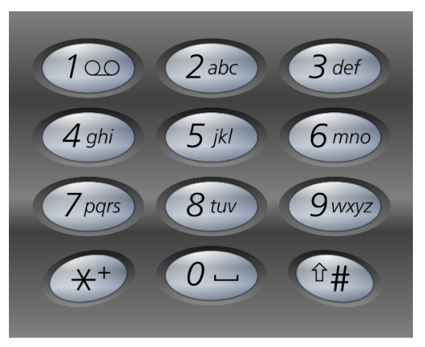

# 电话号码的字母组合

## 问题
给定一个仅包含数字 2-9 的字符串，返回所有它能表示的字母组合。答案可以按 任意顺序 返回。

给出数字到字母的映射如下（与电话按键相同）。注意 1 不对应任何字母。


## 答案
```js
var letterCombinations = function(digits) {
    if(digits.length==0){
        return [];
    }
    const map={'2':'abc','3':'def','4':'ghi','5':'jkl','6':'mno','7':'pqrs','8':'tuv','9':'wxyz'};
    let ans=[];
    let dfs=(str,index)=>{
        if(str.length==digits.length){
            ans.push(str);
            return;
        }
        for(let item of map[digits[index]]){
            dfs(str+item,index+1);
        }
    }
    dfs('',0);
    return ans;
};
```
## 扩展