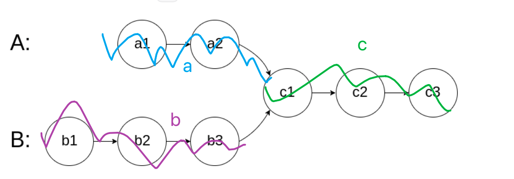

# 相交链表
## 问题

给你两个单链表的头节点 headA 和 headB ，请你找出并返回两个单链表相交的起始节点。如果两个链表不存在相交节点，返回 null 。

图示两个链表在节点 c1 开始相交：


题目数据 保证 整个链式结构中不存在环。

注意，函数返回结果后，链表必须 保持其原始结构 。

自定义评测：

评测系统 的输入如下（你设计的程序 不适用 此输入）：

intersectVal - 相交的起始节点的值。如果不存在相交节点，这一值为 0
listA - 第一个链表
listB - 第二个链表
skipA - 在 listA 中（从头节点开始）跳到交叉节点的节点数
skipB - 在 listB 中（从头节点开始）跳到交叉节点的节点数
评测系统将根据这些输入创建链式数据结构，并将两个头节点 headA 和 headB 传递给你的程序。如果程序能够正确返回相交节点，那么你的解决方案将被 视作正确答案 。


## 答案
```js
var getIntersectionNode = function(headA, headB) {
    let pa=headA;
    let pb=headB;
    while(pa!=pb){
        pa=pa==null?headB:pa.next;
        pb=pb==null?headA:pb.next;
    }
    return pa;
};
```
## 扩展

让a走一遍自己的再走一遍b相交之前的距离，和b走一遍自己的再走一遍a相交之前的距离，是相等的

因为a+c+b==b+c+a