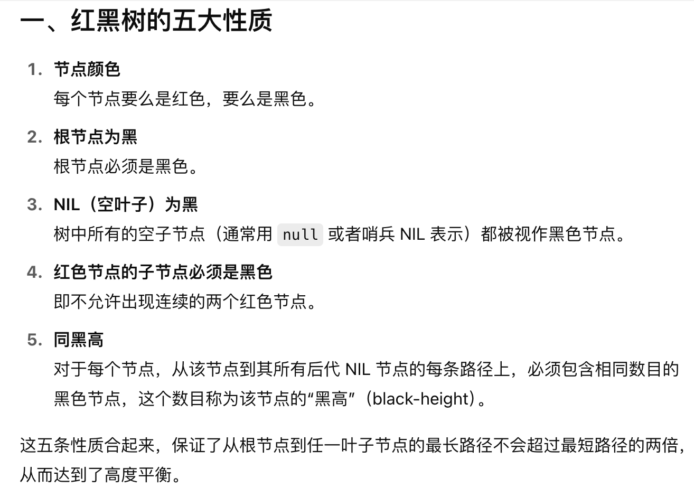

# 将有序数组转换为二叉搜索树
## 问题
```js
给你一个整数数组 nums ，其中元素已经按 升序 排列，请你将其转换为一棵 平衡 二叉搜索树。
```
## 答案
```js
var sortedArrayToBST = function(nums) {
    let dfs=(left,right,nums)=>{
        if(left>right) return null;
        let mid=Math.floor((left+right)/2);
        let root=new treeNode(nums[mid]);
        root.left=dfs(left,mid-1,nums);
        root.right=dfs(mid+1,right,nums);
        return root;
    }
    return dfs(0,nums.length-1,nums);
}
```
## 扩展
平衡二叉树：该树的任意结点的左右子树高度差不超过1

二叉搜索树（*BST*）：左小右大，严格


红黑树（Red-Black Tree）是一种自平衡的二叉搜索树，它在普通二叉搜索树的基础上增加了“颜色”属性，并通过严格的颜色和旋转规则保证树的高度始终是 O(log n)，从而使查找、插入、删除等操作的最坏时间复杂度都能保持在 O(log n)。

