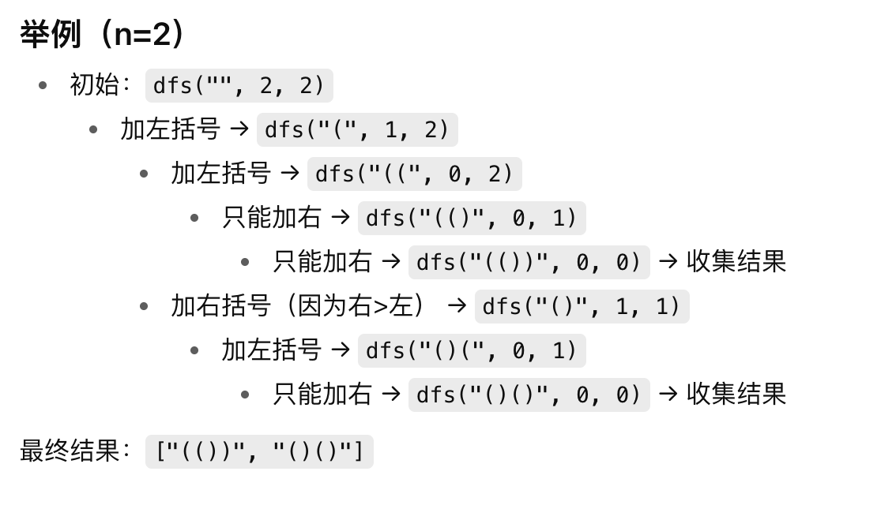

# 括号生成
## 问题
数字 n 代表生成括号的对数，请你设计一个函数，用于能够生成所有可能的并且 有效的 括号组合。

示例 1：

输入：n = 3

输出：["((()))","(()())","(())()","()(())","()()()"]

示例 2：

输入：n = 1

输出：["()"]

## 答案
```js
var generateParenthesis = function(n) {
    let res=[];
    let dfs=(path,left,right)=>{
        if(left==0&&right==0){
            res.push(str);
            return;
        }
        if(left>0){
            dfs(path+'(',left-1,right);
        }
        if(right>left){
            dfs(path+')',left,right-1);
        }
    }
    dfs('',n,n);
    return res;
};
```
## 扩展
回溯

定义一个res，一个path

递归

**出口**是左括号和右括号剩余数量都为0

两个if

压入左括号条件是left>0

压入右括号条件是right>left

