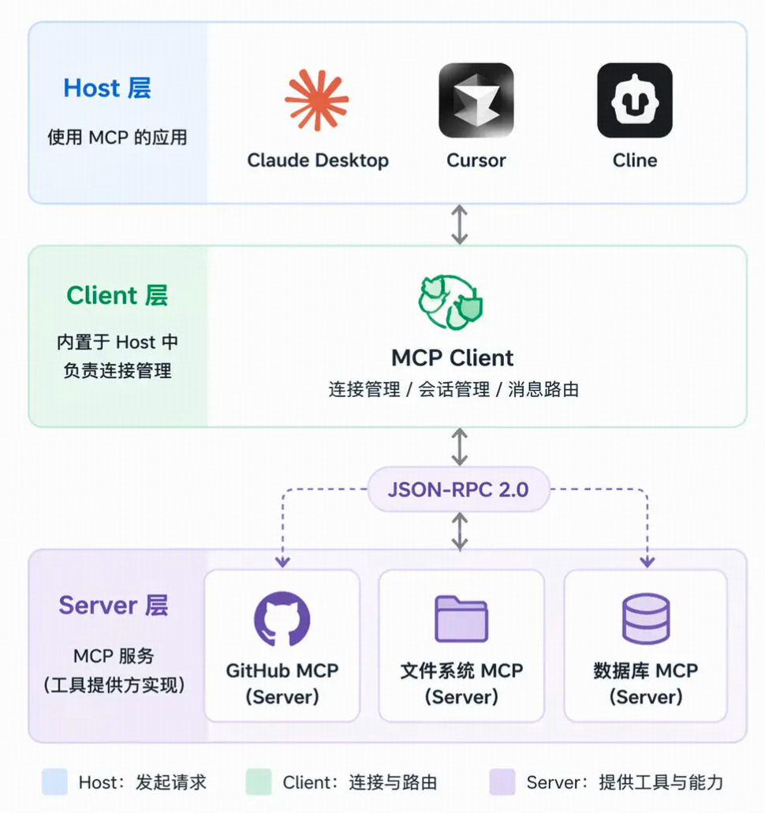

# Agent 的定义

## 区别

- 传统 AI：每次回答是独立、被动响应，问一个问题就回答一个问题。
- AI agent：**能够通过自主规划和行动来完成目标。**具体来说：给一个复杂目标，agent可以自己拆分任务，通过调工具、访问记忆、感知环境来一步步执行，直到完成目标。

## agent 运作闭环

感知-规划-行动-再感知

实现闭环的三个必要条件：

- **工具调用**
- **记忆机制**
  分为短期记忆和长期记忆。短期记忆是当前任务执行过程中的中间状态（比如第一步搜到了什么、第二步计算结果是多少等等），长期记忆可以跨任务（通常用向量数据库来存储，需要时做语义检索拿回来）
- **多步推理和自我纠错**

## 两个重要标准协议

**1. MCP （Model Context Protocol，模型上下文协议）**
定义了一套标准的 JSON-RPC 协议，工具提供方按这个协议暴露能力（变成一个MCP Server），支持MCP的Agent通过内置的MCP Client可以发现、调用这些工具，不需要额外写适配代码。

三层：

**2. A2A （Agent2Agent，Agent间通信协议）**

核心设计是Agent Card概念，每个 Agent 都有一张「名片」，上面写着它能做什么、正在做什么、需要什么输入，其他 Agent 读了这张名片就知道该怎么跟它协作。

## ps

模型本身只是「大脑」，工具的真正执行是你的代码，模型只负责决策。
