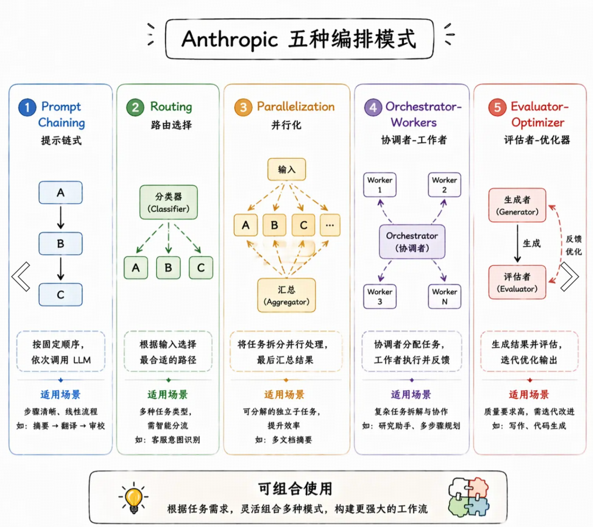

# Workflow、Agent、Tools

## Tools

最小的能力单元。本质上是一个**按特定格式暴露给LLM的函数**，和普通函数的唯一区别是额外有一份说明书 schema（名字、描述、参数类型）

```py
tools = [
    {
        "name": "web_search",
        "description": "在互联网上搜索信息，适合查询实时数据或不确定的知识",
        "parameters": {
            "type": "object",
            "properties": {
                # 参数说明清晰，LLM 看到这个描述就知道该填什么
                "query": {"type": "string", "description": "搜索关键词，越具体越好"}
            },
            "required": ["query"]
        }
    },
    {
        "name": "send_email",
        "description": "向指定邮箱发送一封邮件",
        "parameters": {
            "type": "object",
            "properties": {
                "to":      {"type": "string", "description": "收件人邮箱地址"},
                "subject": {"type": "string", "description": "邮件主题"},
                "body":    {"type": "string", "description": "邮件正文内容"}
            },
            "required": ["to", "subject", "body"]
        }
    }
]
```

好工具的四个核心原则：职责单一、描述要精确、错误信息要清晰、参数设计要简洁

## Agent

### 主动做决策

想清楚->行动->看结果->重复以上

Thought -> Action -> Observation

### 停止条件

`while true`的轮次无法确定，由LLM实时决定。

1. LLM 主动判断任务完成（最理想状态）
2. 达到设置的最大循环次数
3. 达到设置的总token预算上限
4. 超时机制

通常以上四种同时存在，哪个先触发就用哪个。

因为**行为的不确定性**导致难以复现当时执行路径来排查问题，解决方式：给 Agent 加上详细执行日志，记录每一步思考过程和工具调用结果，方便事后追溯。

## Workflow

把整个执行流程的骨架写在代码里，LLM、Agent、Tools都只是流程里的节点，节点只负责完成自己的那一步，整体走哪条路、下一步去哪里，全由开发者的代码决定。

**workflow和agent的核心区别**：下一步去哪的决策，Agent由LLM自己决定，Workflow由开发者在代码里写死。

## 主流用法

Agentic Workflow

用 Workflow 固定主流程的骨架，在需要灵活判断的节点嵌入 Agent，其余固定节点直接用 LLM 或 Tools

**五种编排模式**

1. Prompt Chaining（提示链）
2. Routing（路由选择）
3. Parallelization（并行化）
4. Orchestrator-Workers（编排者-工人）
5. Evaluator-Optimizer（评估者-优化者）


