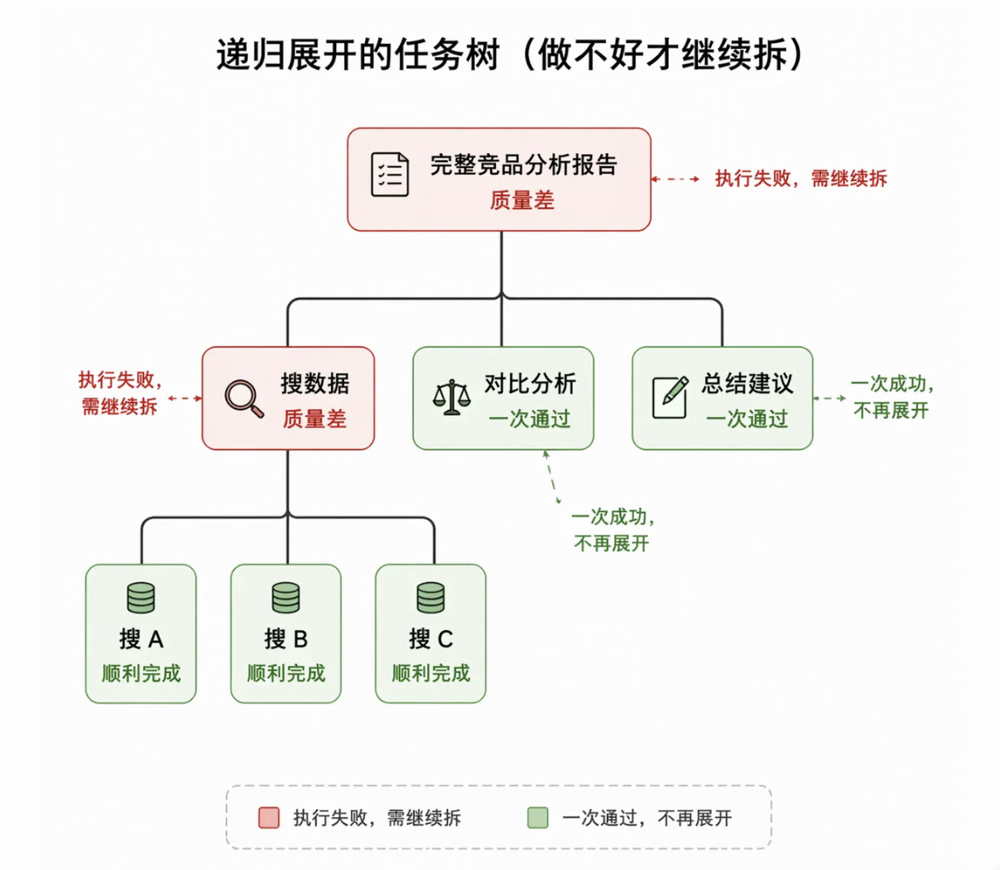

# 任务拆分

## 需要拆分的原因

LLM 的 context window 有大小限制。任务越大，中间状态越多，LLM 难以持续追踪。

额外好处：每个步骤独立输出可以被单独检查和验证。可以单独重试某一步，不用从头跑整个任务。

## 两种思路

1. 静态拆分

   提前把任务流程设计好，固定成workflow

   好排查，灵活性低

2. 动态拆分
   拆分也交给LLM去做

   灵活性强，不稳定

实际项目里降低40%到60%的端到端延迟是很常见的数字，前提是任务本身的依赖关系稀疏、工具I/O占主要耗时

有向无环图（DAG）

节点是步骤，边是依赖

判断一个步骤是不是原子的：能否写一个清晰的函数签名

## 好的拆分

1. 完备性
2. 独立性
3. 可验证性

