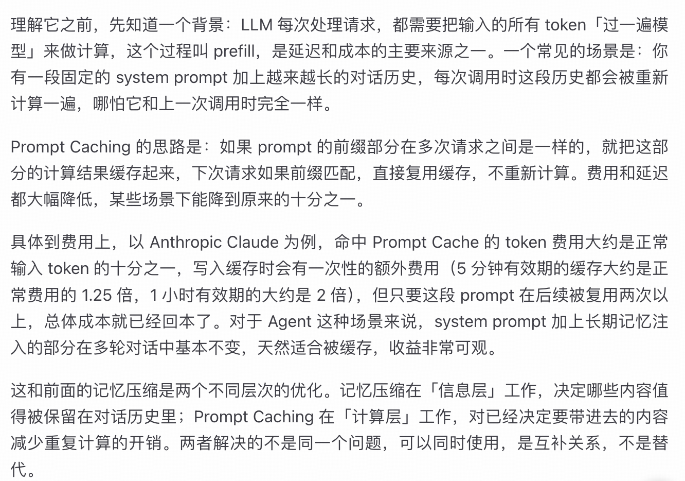

# 记忆压缩方法

最常见的工程组合：滑动窗口+摘要

## 滑动窗口

金鱼记忆

## 摘要压缩

丢失细节

**层级式摘要**：最近 10 轮保持原文，10 到 50 轮的历史压缩成一份「中期摘要」，50 轮之前的历史进一步压缩成更精炼的「长期摘要」

## 重要性过滤

按价值而不是时间过滤。

**两种打分方式**：规则打分、LLM打分

**观察遮蔽**：不删除低分内容，而是在构造prompt时选择性隐藏某些历史条目

**主动压缩**：在每一步执行完之后，主动判断哪些中间过程可以压缩，立刻压缩替换

## 结构化抽取

高效、信息密度高

代价是开发成本最高，需要预先定义重要字段

## Prompt Caching

