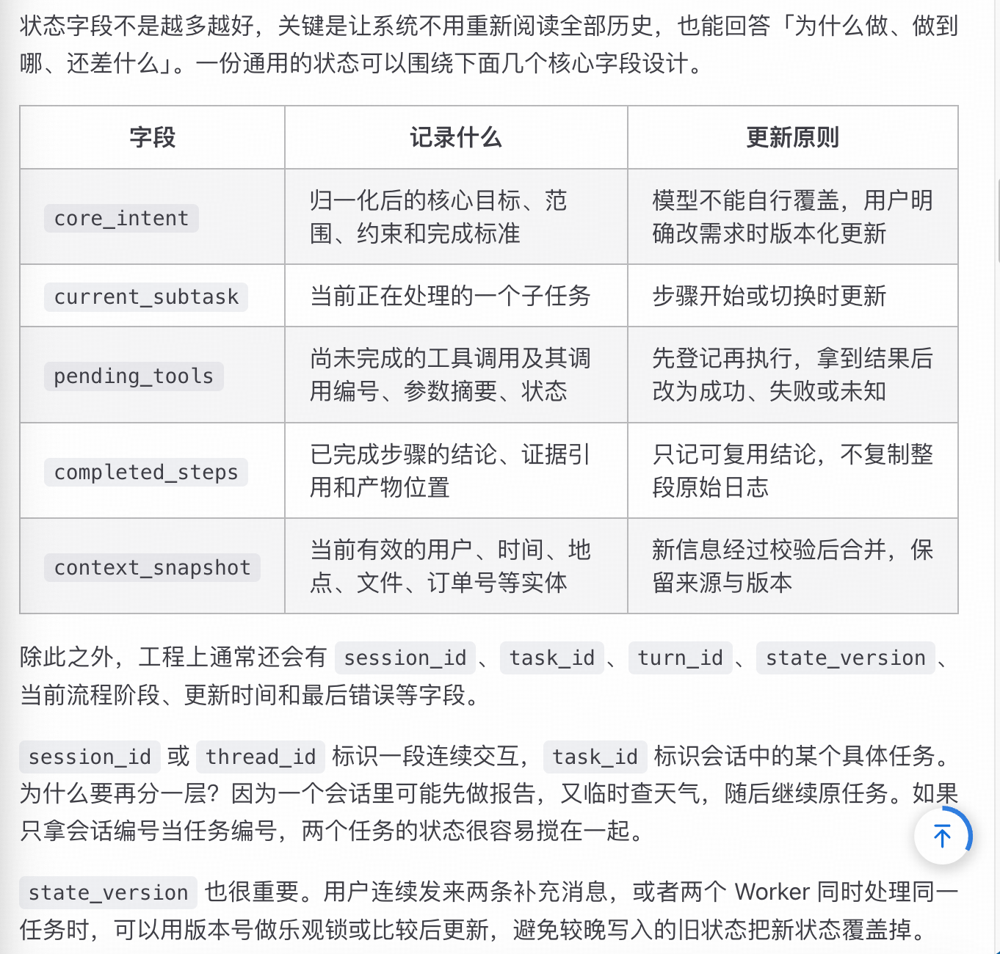

# 管理多轮对话状态

核心观点：状态管理不等于"把历史消息塞进 Redis"。**对话历史是"证据"，结构化状态才是"当前结论"**。

## 分开管理四类信息

| 信息类型 | 内容 | 生命周期 |
| --- | --- | --- |
| 对话历史 | 用户原话、模型回复、工具返回 | 当前会话 |
| 业务状态 | 已确认的事实（日期、金额、审批结果） | 当前业务任务 |
| 任务状态 | 目标、子任务、步骤状态、错误 | 一次任务执行 |
| 长期记忆 | 用户偏好、可复用经验 | 跨会话、跨任务 |

## 任务状态字段

- 业务字段：`core_intent`（意图锚点，模型不可自行覆盖）、`current_subtask`、`pending_tools`、`completed_steps`、`context_snapshot`
- 工程字段：`session_id` / `thread_id`、`task_id`、`turn_id`、`state_version`

## 防跑偏三道防线

1. 保留结构化 `core_intent`（含产物、约束、完成标准），模型不能自行改写
2. 进度核对：Checker 检查每一步是否真的在推进核心目标
3. 保留事实来源和状态版本，可回溯、可回滚

## 中断恢复

恢复顺序：校验身份 → 加载最近提交的 checkpoint → 核对 `pending_tools` → 重组最小上下文 → 从合法状态继续。

- 对处于 `unknown` 状态的工具调用，先去外部系统核对，避免重复发消息 / 重复付款
- 依赖幂等键去重，不迷信"恰好执行一次"；无法查询且不支持幂等时转人工确认

## 线上实现还要补哪些细节

**1. 状态存储冷热分层**

- 活跃会话放低延迟存储（如 Redis），关键 checkpoint 和审计记录落持久化数据库或对象存储
- 用 TTL 清理可重建的会话缓存，但不能让等待审批的长期任务"因为半小时没人说话就直接消失"

**2. 多实例并发控制**

- 按 `task_id` 加租约或分布式锁，防止两个 Worker 同时推进同一任务
- 配合 `state_version` 做"比较后更新"（CAS）
- 每条请求带 `request_id`，重复提交时直接返回之前的处理结果

**3. 数据安全**

- 不长期保存所有原始工具结果，更不能把密码、令牌等敏感信息塞进状态
- 大结果存外部，状态里只保留摘要、哈希和引用
- 日志和 Trace 脱敏，按租户和用户做访问隔离

**4. 可观测性指标**

- 除任务完成率外，还要关注：意图改写次数、澄清率、非法状态转换次数、恢复成功率、重复副作用次数、中断到恢复耗时
- 对比恢复后结果与"不中断基线"的一致性

> 参考：[会话状态管理](https://xiaolinnote.com/ai/agent/18_session_state.html)
