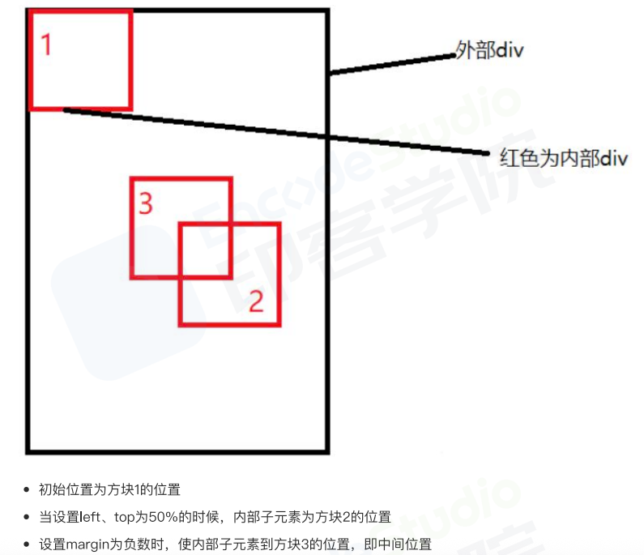

# 居中方式

盒子居中

水平中间：

- margin : 0 auto
- justify-content : center

垂直中间：

- display：inline-block vertical-align:middle （vertical-align 对齐的方法是寻找兄弟元素中最高的元素作为参考）兄弟元素可替换成伪元素：：before
- 绝对定位+平移 transform（50%），性能比使用margin 好（属于合成属性，不发生重排）
- flex：align-items


# 水平垂直居中

### 1.定位+margin：auto

父级设置为相对定位，子级绝对定位。子级的虚拟占位撑满整个父级

### 2.定位+margin负值



```
<style>
 .father {
 position: relative;
 }
 .son {
 position: absolute;
 top: 50%;
 left: 50%;
 margin-left:-50px;
 margin-top:-50px;
 width: 100px;
 height: 100px;
 }
</style>
<div class="father">
 <div class="son"></div>
</div>
```

**需要知道子元素自身的高度**

### 3.定位+transform

不需要知道子元素自身高度

`transform: translate(-50%,-50%);`

### 4.table 布局

父级：
- display:table-cell
- vertical-align:middle
- text-algn:center

子级：
- display:inline-block

### 5.flex 弹性布局

父级：
- display：flex
- justify-content：center
- align-items：center

### 6.grid 网格布局
- display:grid
- align-items:center
- justify-content:center

