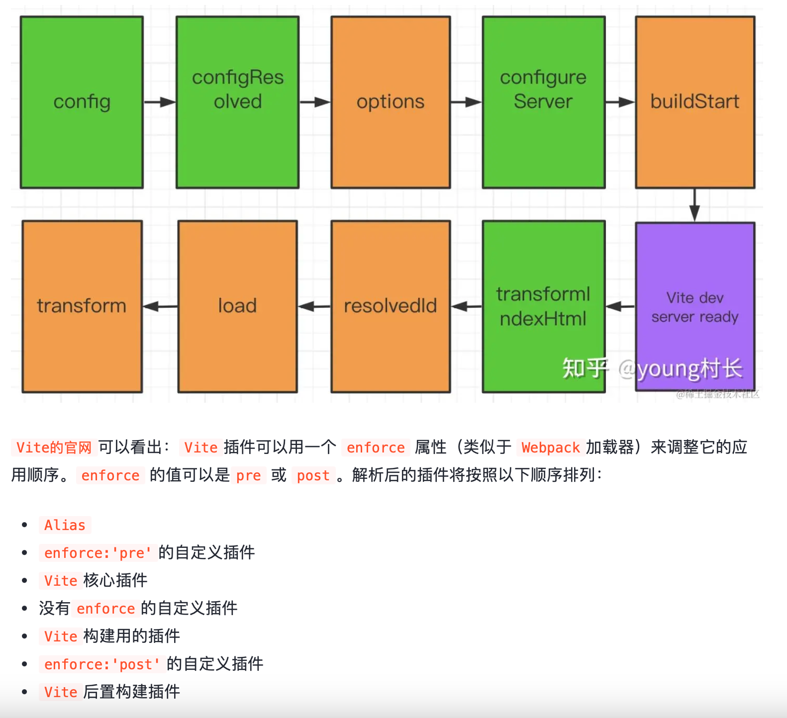

# Vite 插件
下面是一个简单的 Vite 插件示例，它会在构建过程中将代码中的 `__VITE_PLUGIN_GREETING__` 占位符替换为自定义文本：

```javascript
// vite.config.js
import { defineConfig } from 'vite'

// 基础版插件
const simplePlugin = () => ({
  name: 'simple-vite-plugin',
  transform(code) {
    return code.replace(/__VITE_PLUGIN_GREETING__/g, 'Hello from Vite Plugin!')
  }
})

// 可配置版插件（可选增强）
const configurablePlugin = (options = {}) => {
  const replacement = options.text || 'Default greeting'
  return {
    name: 'configurable-vite-plugin',
    transform(code, id) {
      // 仅处理 JS/TS 文件
      if (/\.[jt]sx?$/.test(id)) {
        return {
          code: code.replace(/__VITE_PLUGIN_GREETING__/g, replacement),
          map: null // 可选 source map
        }
      }
    }
  }
}

export default defineConfig({
  plugins: [
    simplePlugin(),
    // configurablePlugin({ text: 'Custom greeting' })
  ]
})
```

**插件说明**：

1. **基本结构**：
   - 插件是一个返回对象的工厂函数
   - 必须包含 `name` 属性作为插件标识
   - 通过生命周期钩子（如 `transform`）实现功能

2. **核心功能**：
   - 在 `transform` 钩子中处理源代码
   - 使用正则表达式替换指定占位符
   - 支持返回转换后的代码和 source map

3. **可选项**：
   - 通过插件参数接受配置
   - 添加文件类型过滤（`.js/.ts` 等）
   - 支持生成 source map（需要额外处理）

**使用方式**：

1. 在代码中任意位置使用占位符：
```javascript
// main.js
console.log(__VITE_PLUGIN_GREETING__)
```

1. 运行开发服务器或构建：
```bash
npm run dev
# 或
npm run build
```

1. 输出结果会变成：
```javascript
console.log("Hello from Vite Plugin!")
```

**进阶扩展方向**：
- 添加文件类型白名单
- 支持多个替换模式
- 实现虚拟模块加载
- 添加开发服务器中间件
- 支持热更新逻辑
- 处理 CSS 等非 JS 资源

这个插件演示了 Vite 插件的核心机制，你可以根据实际需求组合使用不同的生命周期钩子（如 `resolveId`、`load`、`configureServer` 等）实现更复杂的功能。


https://juejin.cn/post/7276260308515389480

十三个钩子：
**rolledup原来就有**：
- options
- buildStart
- resolveId
- load
- transform
- buildEnd
- closeBundle
**新增的特性:**
- config
- configResolved
- configServer
- configPreviewServer
- transformIndexHtml
- handleHotUpdate

