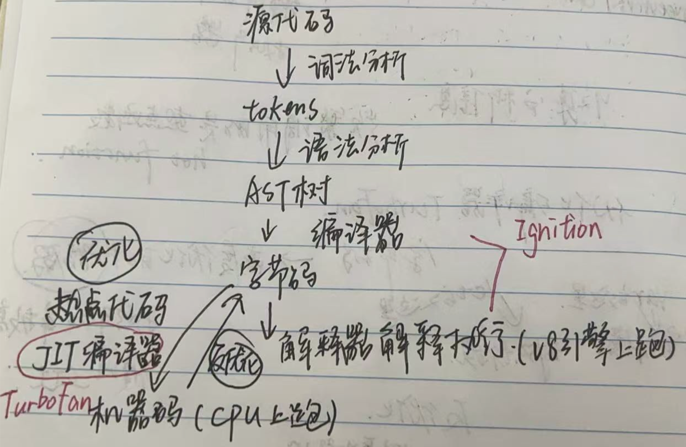
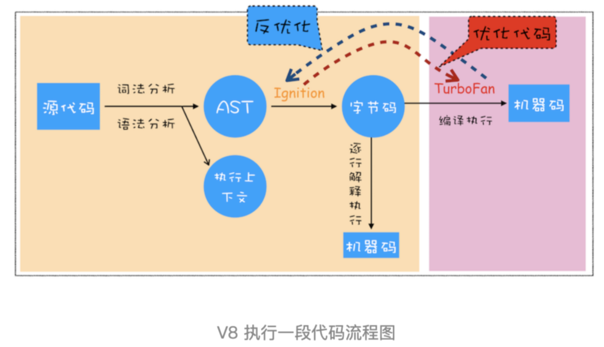

# V8 编译

首先对源代码进行词法分析，生成tokens；然后对tokens进行语法分析，生成AST抽象语法树；编译器将AST转换成字节码；解释器对字节码进行解释执行；

如果发现有热点代码，JIT编译器将字节码转成机器码，直接在cpu上跑，更高效；

创建上下文是在代码执行阶段，而不是编译阶段

ignition=编译器+解释器

TurboFan是JIT编译器

PS：

AST：Abstract Syntax Tree

分词，词法解析，生成抽象语法树（AST）和执行上下文

解释器将 AST 解析成字节码解释执行

发现有热点代码（HotSpot），比如一段代码被重复执行多次。直接 JIT 编译执行，省去翻译过程

**JIT：Just-In-Time Compilation（即时编译）**

javascript是一种即时编译语言，JIT，混合了解释型和编译型的特性，优化了执行效率

js引擎是v8，渲染引擎是blink
