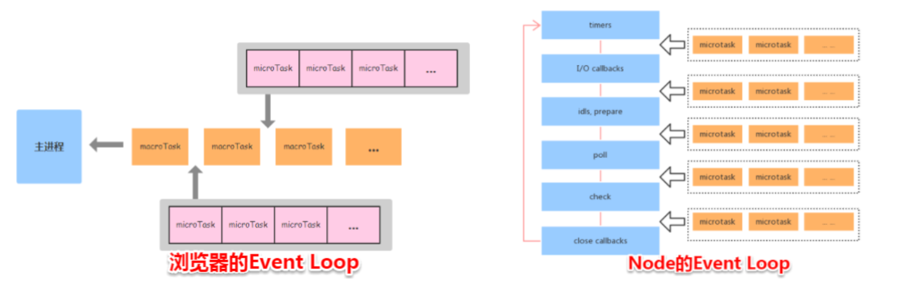
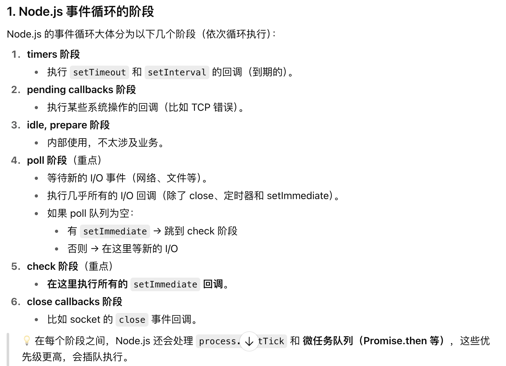

# 浏览器 JS 事件循环

浏览器是通过事件循环来协调用户操作、脚本执行、渲染、网络请求等操作的调度。通过**任务队列**（**可能有多个，看浏览器实现，浏览器维护**）来管理任务

可以分为微任务（micro task）队列和宏任务（macro task）队列。

1. **执行顺序铁律** ：每个事件循环中，**先执行同步代码 ⇒ 清空微任务队列 ⇒ 执行下一个宏任务** 。
2. 微任务可以认为是**寄生在宏任务结束后** 的“快速通道”任务。

#### 为什么需要区分宏任务和微任务？

- **微任务优先级高** ：确保与当前执行上下文紧密相关的操作**优先执行** （例如 Promise 状态处理、DOM 更新后的回调）。
- **避免阻塞渲染** ：浏览器通常在宏任务之间执行 UI 渲染，微任务逻辑可以抢在渲染前完成（如 `MutationObserver` 监听 DOM 变化后立即处理）。

MutationObserver：https://juejin.cn/post/7225862344483094586?searchId=20250926094006B6E3B283594728B00D95

具体过程：

1. 执行一个任务（执行栈为空就从任务队列中获取）。
2. 执行过程中如果遇到微任务，就将它添加到微任务的任务队列中（js 引擎维护）。
3. 任务执行完毕后，立即执行当前微任务队列中的所有微任务（包括执行期间加入的微任务）（依次执行）。
4. 当前任务执行完毕，浏览器会检查要不要进行渲染（比如影响视觉显示的操作以及 scroll，resize 事件等、具体看浏览器实现），如果要就渲染线程接管

	1. 渲染前会调用 RAF （requestAnimationFrame）回调函数（有些浏览器在渲染之后调用），如果 RAF 回调函数中有新的 RAF 回调则会到下一次渲染前调用
	2. 然后走一遍渲染过程（ 计算 html css、 重排、重绘、合成）

		如果一帧时间还没结束或者没有其他的任务，一般会执行 requestIdleCallback

			- 具体是否有空执行要看浏览器的调度，使用 timeout 参数可以强制执行。
			- 可能在几帧的时间内浏览器都是空闲的，并没有发生任何影响视图的操作，会有最高 50ms 的 deadline

5. 如果不需要进行渲染，则直接开始取下一个任务


RIC 和 RAF 是和帧相关的。  

宏任务主要包含：
- script（整体代码）
- setTimeout
- setInterval
- setImmediate
- I/O
- 交互事件

微任务主要包含
- Promise.then()
- Promise.catch()
- Promise.finally()
- new MutationObserver
- process.nextTick() 
- 微任务队列不属于任务队列

在浏览器中 setTimeout 的延时设置为 0 的话，会默认为 4ms，NodeJS 为 1ms


new Promise 是同步执行的，promise.then 里面的回调才是异步的。

微任务是在当前事件循环的尾部去执行；宏任务是在下一次事件循环的开始去执行。就是先执行微任务

**简单小结一下微任务和宏任务的本质区别**

**宏任务特征：有明确的异步任务需要执行和回调；需要其他异步线程支持。**

**微任务特征：没有明确的异步任务需要执行，只有回调；不需要其他异步线程支持。**



# 解释事件循环
首先，JS是一门单线程的语言，那么如果要在单线程语言里实现非阻塞，就可以用到事件循环的办法

js的任务可以分为同步任务和异步任务，然后异步任务中又分为宏任务和微任务。那么从一开始，同步任务进入主线程也就是主执行栈，遇到异步任务就推入任务队列。当主线程内的任务执行完毕后，就会去任务队列中读取异步任务，然后再推入主线程中执行。这个过程的不断重复就叫做事件循环

然后在微任务和宏任务中的话，如果在执行一个宏任务遇到微任务的话，就会把微任务放到微任务的事件队列中。等到当前的宏任务执行完成后，就会去查看微任务的事件队列，然后将里面所有的微任务依次执行完成

具体的微任务包括了promise的回调函数，.then.catch等等，MutationObserver, 还有next Tick。宏任务就包括脚本的整体的执行，然后定时器，还有IO操作，以及页面ui回流重绘，以及用户事件，还有Messagechannel post Message啊，setImmediate等等



当“该到 16.6ms 了但主线程还忙”时，浏览器会跳过当帧；rAF 与绘制一起顺延到下一次可绘制的时刻执行。==》**掉帧**

1. 执行同步代码（主线程）。
2. 执行所有 微任务（Promise.then、MutationObserver 等）。
3. 渲染前阶段：执行 requestAnimationFrame 回调。
4. 浏览器执行页面渲染（绘制）。
5. 如果有需要，进入下一次循环，处理宏任务（如 setTimeout/setInterval）。

所以实际上requestAnimationFrame既不是宏任务也不是微任务，而是一个独特的阶段

```js
console.log("start")

requestAnimationFrame(() => console.log("rAF"))

setTimeout(() => console.log("timeout"), 0)

Promise.resolve().then(() => console.log("microtask"))

console.log("end")
```

```js
start
end
microtask     // 微任务先执行
rAF           // 下一次渲染前
timeout       // 宏任务（下一轮事件循环）

```