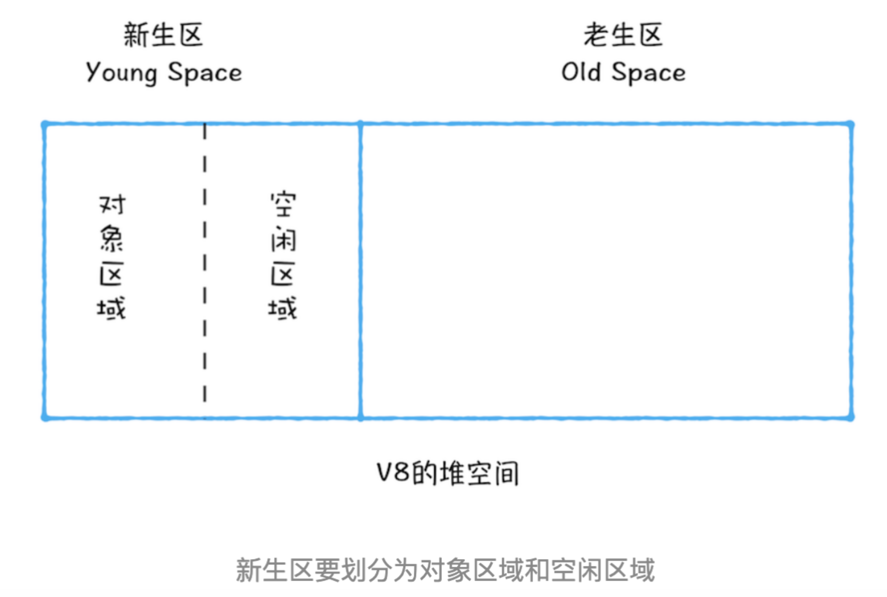
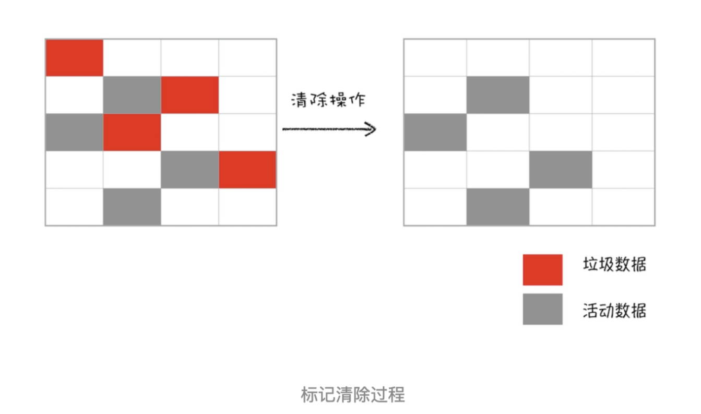
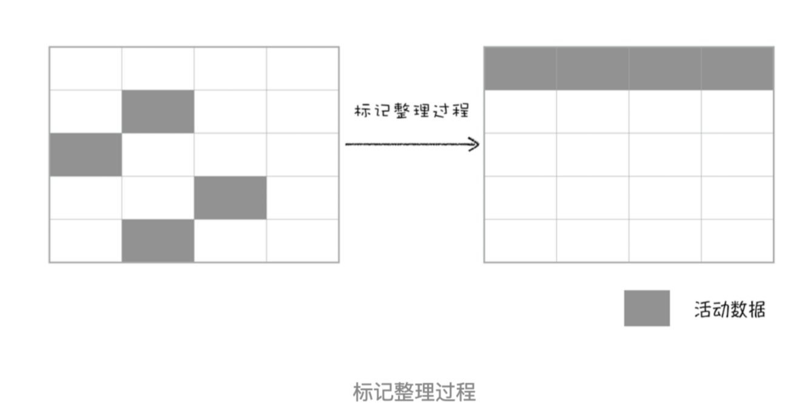

# 浏览器垃圾回收
### 栈和堆的垃圾回收步骤
**栈**中数据当函数执行上下文运行结束，`ESP` 栈顶指针下移，销毁执行上下文

回收**堆**中数据：

第一步是标记空间中活动对象（还在用）和非活动对象（没用）。

第二步是回收非活动对象所占据的内存

第三步是做内存整理

### 主/副垃圾回收器

**副垃圾回收器（Scavenge 算法），主要负责新生代的垃圾回收。**

新加入的对象都会存放到对象区域，当对象区域（from）快被写满时，就需要执行一次垃圾清理操作：

- 首先要对对象区域中的垃圾做标记
- 接着进入垃圾清理阶段，副垃圾回收器会把这些存活的对象复制到空闲区域（to）中，同时它还会把这些对象**有序地排列**起来，所以这个复制过程，也就相当于完成了内存整理操作，复制后空闲区域就没有内存碎片了。
- 完成复制后，对象区域与空闲区域进行**角色翻转**。

由于复制操作需要时间成本，如果新生区空间设置得太大了，那么每次清理的时间就会过久，所以为了执行效率，**一般新生区的空间会被设置得比较小**。也正是因为新生区的空间不大，所以很容易被存活的对象装满整个区域。为了解决这个问题，JavaScript 引擎采用了**对象晋升策略**，也就是经过**两次垃圾回收**依然还存活的对象，会被移动到老生区中。

**主垃圾回收器，主要负责老生代的垃圾回收。**

老生区的对象一般比较大，通过复制操作消耗时间长，因而，主垃圾回收器是采用**标记 - 清除**（Mark-Sweep）的算法进行垃圾回收

- 首先是标记过程阶段。标记阶段就是从一组根元素开始，递归遍历这组根元素，在这个遍历过程中，能到达的元素称为活动对象，没有到达的元素就可以判断为垃圾数据标位红色。
- 接着清理红色标记数据，整理内存 e

### 优化
增量标记算法：将一个完整的垃圾回收任务拆分为很多小的任务，可以穿插在其他的 JavaScript 任务中间执行

1. 什么时候捡垃圾
    - 前端有其特殊性，垃圾回收的时候会造成页面卡顿。
    - 分代收集（多回收新生代，少回收老生代）、增量收集（引擎将垃圾收集工作分成更小的块，每次处理一部分，多次处理）、闲时收集（垃圾收集器只会在 CPU 空闲时尝试运行）。
- 引用类型
    - 在没有引用之后，通过 V8 自动回收。
- 值类型
    - 如果处于闭包的情况下，要等闭包没有引用才会被 V8 回收。
    - 非闭包的情况下，等待 V8 的新生代切换的时候回收。（逃逸的包装对象）

### **新旧算法对比**

|**维度**|**引用计数（旧）**|**标记-清除（旧）**|**分代式回收（新）**|
|---|---|---|---|
|**循环引用处理**|无法处理|有效处理|同标记-清除，有效处理|
|**内存碎片**|无（直接释放对象）|出现碎片，需整理|新生代复制消除碎片；老生代整理|
|**执行效率**|实时回收，高频操作性能差|全堆扫描，耗时较长|分代优化，减少全堆扫描|
|**暂停时间**|短但频繁|长时间阻塞（全堆扫描）|增量标记、并发 GC 大幅减少阻塞|
|**适用场景**|简单场景|通用但效率低|复杂 Web 应用（Chrome V8）|