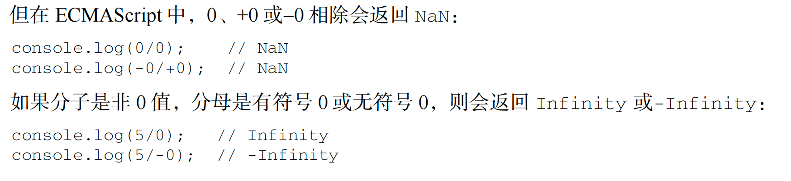

# 各标识符类型比较总结

## 表格一览

| 类型                    | 示例        | 解释                                                          | typeof                   |
| ----------------------- | ----------- | ------------------------------------------------------------- | ------------------------ |
| `undefined`             | `undefined` | 未赋值变量的默认值 通常自动生成                            | `undefined`              |
| `null`                  | `null`      | 无对象 主动赋的空值                                        | `object`（历史遗留问题） |
| 空字符串                | `""`        | 长度为 0 不是 null，也不是 undefined                       | `string`                 |
| `NaN` (Not a Number) | `NaN`       | 非法数字计算,`NaN!==NaN` 任何涉及 NaN 的比较结果都是 false | `number`                 |
| `0`                     | `0`         | 数字 0                                                        | `number`                 |
| `false`                 | `false`     | 布尔值，逻辑假                                                | `boolean`                |
| `true`                  | `true`      | 布尔值，逻辑真                                                | `boolean`                |
| `[]`                    | `[]`        | 空数组，属于对象                                              | `object`                 |
| `{}`                    | `{}`        | 空对象                                                        | `object`                 |
| `Symbol()`              | `Symbol()`  | 表示唯一标识的符号类型                                        | `symbol`                 |
| `BigInt`                | `123n`      | 超大整数类型                                                  | `bigint`                 |

## 逻辑判断中的真假

假的有：undefined,null,"",NaN,false,0,-0

其余为真

