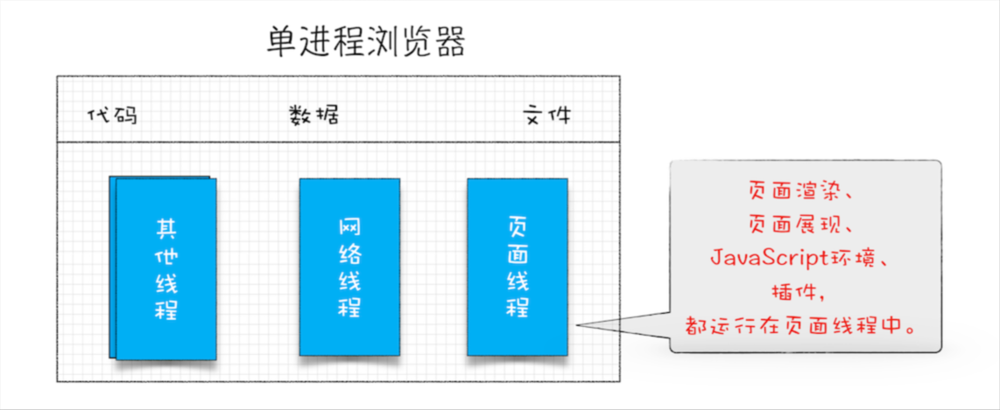
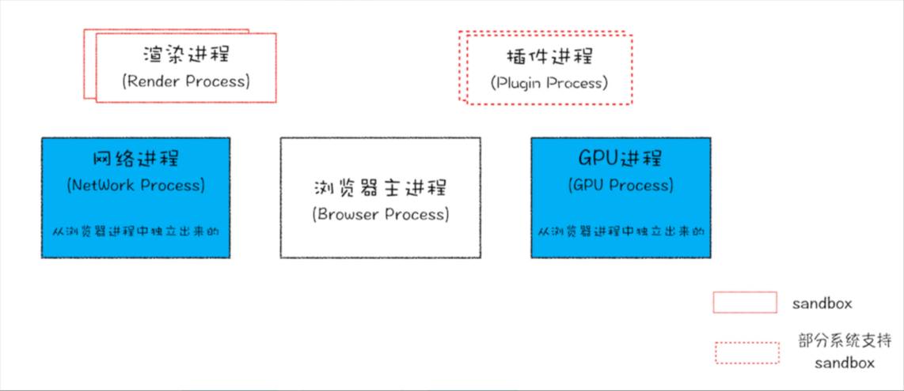
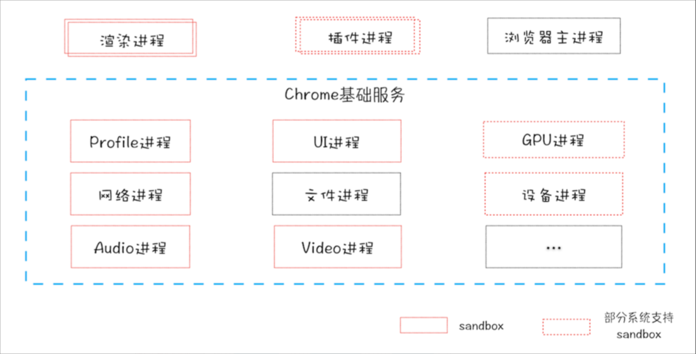
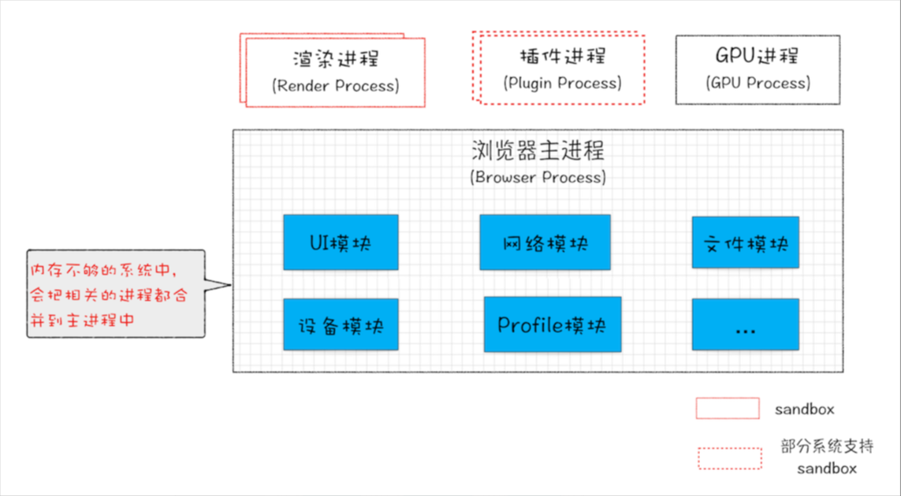

# 浏览器架构

单进程架构：

- 不稳定：其中一个模块崩溃浏览器就会崩溃
- 不流畅：同一时刻只能有一个模块可以执行
- 不安全：没有沙箱隔离，操作系统不安全

多进程架构（**更高的资源占用**）

- **浏览器进程**。主要负责界面显示、用户交互、子进程管理，同时提供存储等功能。
- **渲染进程**。核心任务是将 HTML、CSS 和 JavaScript 转换为用户可以与之交互的网页，排版引擎Blink和JavaScript引擎V8都是运行在该进程中，默认情况下，Chrome会为每个Tab标签创建一个渲染进程。出于安全考虑，渲染进程都是运行在沙箱模式下。
- **GPU进程**。其实，Chrome刚开始发布的时候是没有GPU进程的。而GPU的使用初衷是为了实现3D CSS的效果，只是随后网页、Chrome的UI界面都选择采用GPU来绘制，这使得GPU成为浏览器普遍的需求。最后，Chrome在其多进程架构上也引入了GPU进程。
- **网络进程**。主要负责页面的网络资源加载，之前是作为一个模块运行在浏览器进程里面的，直至最近才独立出来，成为一个单独的进程。
- **插件进程**。主要是负责插件的运行，因插件易崩溃，所以需要通过插件进程来隔离，以保证插件进程崩溃不会对浏览器和页面造成影响

面向服务架构

