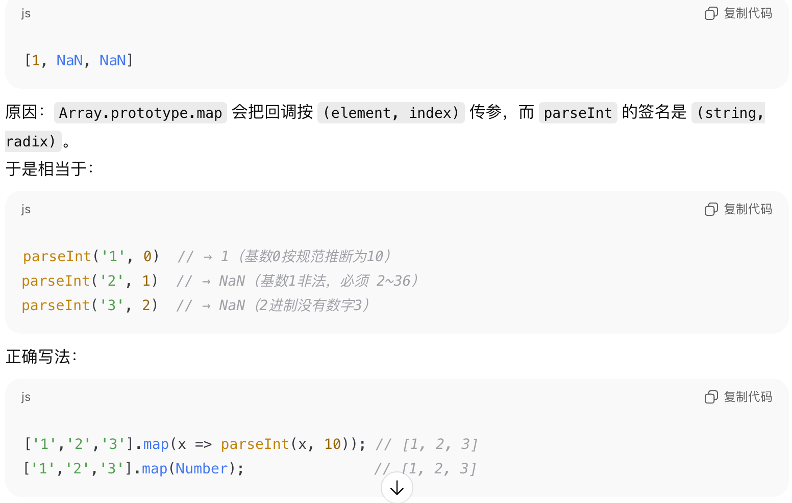

1.  
```shell
chmod a-x test.py
```
用 chmod 取消所有用户对 test 的执行（x）权限

2.  
设置视频自动播放：autoplay

3.  
display: none 会把元素从文档流中移除

4.  
```js
new Array(3).map(item=>1)
```
得到一个稀疏数组，长度为 3，但没有任何元素（映射函数不会执行）：

在控制台一般显示为 Array(3) 或 [empty × 3]，而不是 [1, 1, 1]。

原因：new Array(3) 生成的是空洞数组（只有 length，没有索引），map 只会对存在的索引调用回调，空洞会被跳过，结果仍是空洞数组（长度同为 3）。

5.  
```js
['1','2','3'].map(parseInt)
```


6.  
