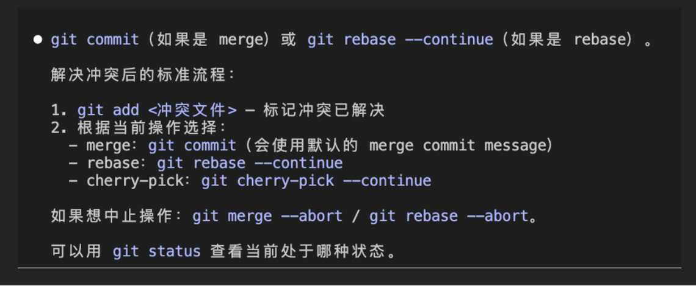

# git使用

## 直接合并

```bash
git fetch origin
git checkout -b 0514 origin/0514
git merge fix/hover-arrow
git push origin 0514

//已有
git fetch origin
git checkout 0514
git pull origin 0514
git merge fix/hover-arrow
git push origin 0514
```

## 合并冲突



## 删除本地及远端分支

删除本地分支：

```bash
# 删除已合并的分支
git branch -d <branch-name>

# 强制删除（包括未合并的分支）
git branch -D <branch-name>
```

删除远端分支：

```bash
# 推荐方式
git push origin --delete <branch-name>
```

删除远端分支后，其他协作者需要运行 `git fetch --prune` 来清理本地的远端分支引用

## git常用命令

- git status 查看工作区和暂存区的状态，
- git push origin(远端仓库名，默认为origin,git自动起的别名) 本地分支名:远端分支名
- 第一次推送，-u首次推送设置上游 git push -u origin 本地分支名 ; 后续推送 git push
- git commit -m "msg"

- git fetch 获取远程更改，但不合并
- git pull 拉取并合并

- git push --force

工作区：本地正在编辑和可见所有文件

暂存区：即将提交的文件 git add

本地仓库：从暂存区永久保存到本地仓库 git commit

远端仓库：将本地提交同步到远端仓库 git push

提交commit格式

- feat 新增功能
- fix 修复bug
- docs 只修改了文档
- style 代码格式修改
- test 增改删测试文件
- ci ci配置文件或脚本的修改
- chore 其他不影响源码和测试的杂项修改，如工具配置
- refactor 代码重构，既不修复bug也不新增功能
- perf 提升代码性能

**else？**
拉取仓库，

```bash
rm -rf .git
```

清空原来的git提交记录

软回退到暂存区：git reset --soft HEAD~1
硬回退：git reset --hard HEAD

git push origin gaga/feat/MAAS-6148 --force-with-lease

git bisect 是 Git 提供的一个 二分查找 工具，帮助你在大量提交中快速定位“哪个提交引入了 bug”。它的核心思路是把「已知好状态」和「已知坏状态」之间的提交区间不断二分，直到找到首个坏提交。
