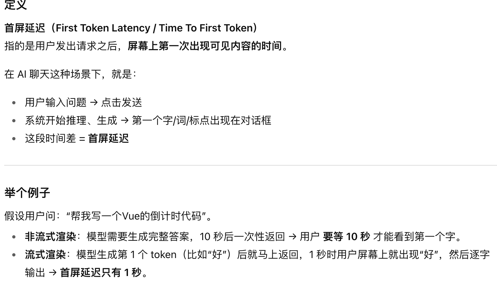
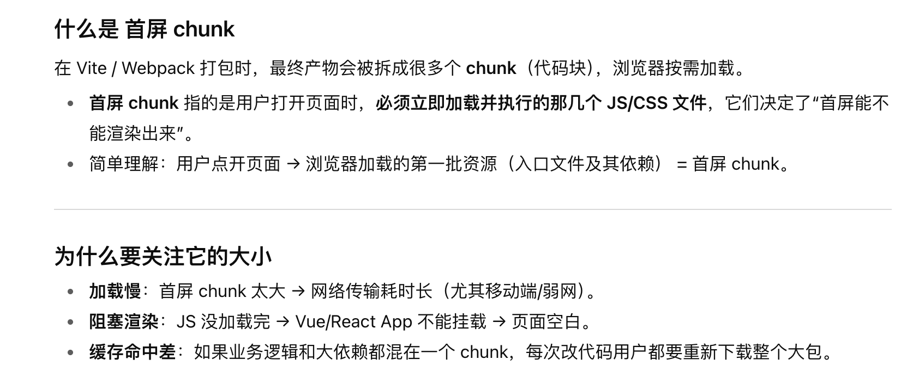

sse:

https://www.ruanyifeng.com/blog/2017/05/server-sent_events.html

接收 `AI` 模型的输出代码：
```js
<div id="out"></div>
<button id="stop">停止</button>
<script>
async function streamSSE(url, payload) {
  const ac = new AbortController();
  document.getElementById('stop').onclick = () => ac.abort();
  const resp = await fetch(url, {
    method: 'POST',
    headers: { 'Content-Type': 'application/json', 'Accept': 'text/event-stream' },
    body: JSON.stringify(payload),
    signal: ac.signal
  });
  if (!resp.ok || !resp.body) throw new Error('网络或后端错误');
  const reader = resp.body.getReader();
  const decoder = new TextDecoder('utf-8');
  const out = document.getElementById('out');
  let buffer = '';
  try {
    while (true) {
      const { done, value } = await reader.read();
      if (done) break;
      buffer += decoder.decode(value, { stream: true });
      // 按行处理（SSE 每条事件以换行分割）
      let idx;
      while ((idx = buffer.indexOf('\n')) >= 0) {
        const line = buffer.slice(0, idx).trim();
        buffer = buffer.slice(idx + 1);
        if (!line || line.startsWith(':')) continue;     // 心跳/注释
        if (!line.startsWith('data:')) continue;
        const data = line.slice(5).trim();
        if (data === '[DONE]') { ac.abort(); break; }
        // 可能是纯文本，也可能是 JSON payload
        let text = data;
        try {
          const obj = JSON.parse(data);
          text = obj.delta || obj.text || JSON.stringify(obj);
        } catch (_) { /* 非 JSON 当作纯文本 */ }
        out.textContent += text; // 边生成边追加
      }
    }
  } finally {
    // 完成解码器刷新
    decoder.decode(new Uint8Array(), { stream: false });
  }
}
// 用法
streamSSE('/api/stream-sse', { prompt: '你好' }).catch(console.error);
</script>
```


### 首屏chunk

