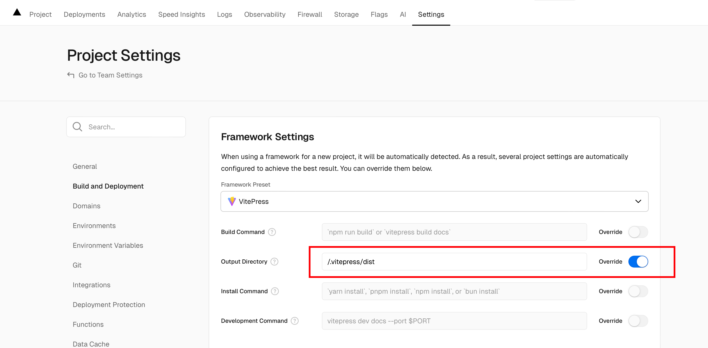

# gaga-blog 部署到服务器

## github page 管理静态内容

没配成啊没配成

## vercel

嗯嗯对，转战 vercel 了

### 优势

- 个人版永久免费，每个月 100G 带宽（别人访问你的项目所耗费的流量），个人项目部署完全够用，需要注意的是团队模式收费，所以要协作你只能付费。
- 内置 CI CD，你可以理解成一个黑盒，项目丢进去，只需要将项目导入 vercel ，一句命令自动部署。
- 因为内置构建流程，支持代码推送、PR 自动触发构建，不同分支唯一地址，方便测试。
- 支持本地、测试、生产三种环境部署，仅仅是命令区别，上手成本极低。
  丰富的集成能力，项目部署自动监控，端到端自动化测试等等，当然这些并并属于 vercel 自身的能力，但它可以为你提供集成入口，让这些成为你自动部署中自动进行的一步，比如构建生产后自动完成性能指标输出，自动化测试，以及后续项目监控等等。

### 部署

```
注册和登录：
访问 Vercel 官网，注册一个账号或使用已有账号登录。
创建新项目：
登录后，点击 Vercel 仪表盘中的 “New Project” 按钮。
选择网站项目的代码仓库（例如 GitHub、GitLab 或 Bitbucket）。如果还没有将代码托管在这些平台上，先将代码上传到其中一个代码托管服务。
导入 Git 仓库：
在 “Import Git Repository” 页面，选择要部署的代码仓库。
Vercel 会自动检测并配置项目设置。可以根据需要进行修改。
配置项目：
项目名称：确认或更改项目名称。
框架预设：Vercel 会根据项目自动检测框架（例如 Next.js）。如果没有正确检测，可以手动选择适合的框架。
构建设置：如果需要，可以修改构建命令和输出目录。通常，Vercel 会自动为大多数常见框架配置这些选项。
部署项目：
点击 “Deploy” 按钮，Vercel 将开始构建和部署项目。
部署过程完成后，会看到一个唯一的域名，网站将托管在该域名下。
自定义域名（可选）：
如果你想使用自定义域名，可以在项目设置中配置。
前往 “Domains” 标签页，添加你的自定义域名，并按照指示将域名的 DNS 记录指向 Vercel 提供的地址。
管理和监控：
在 Vercel 仪表盘中，可以查看部署历史、性能分析、日志等，方便管理和监控项目。
持续集成：
Vercel 会自动为你设置持续集成（CI）。每次你将代码推送到指定的 Git 分支时，Vercel 会自动重新构建和部署你的网站。
```

https://gaga-space.vercel.app

又烂了如何呢

ok 啊 ok 啊成功了

之前打开页面 404

原因是：

project-settings 里面



哦莫，因为 vercel 用的是 github 仓库上的 dist 文件夹，所以在.gitignore 文件中不能添加 dist

⬆️ 全错啊全错！

不需要 dist

好像是要的？
