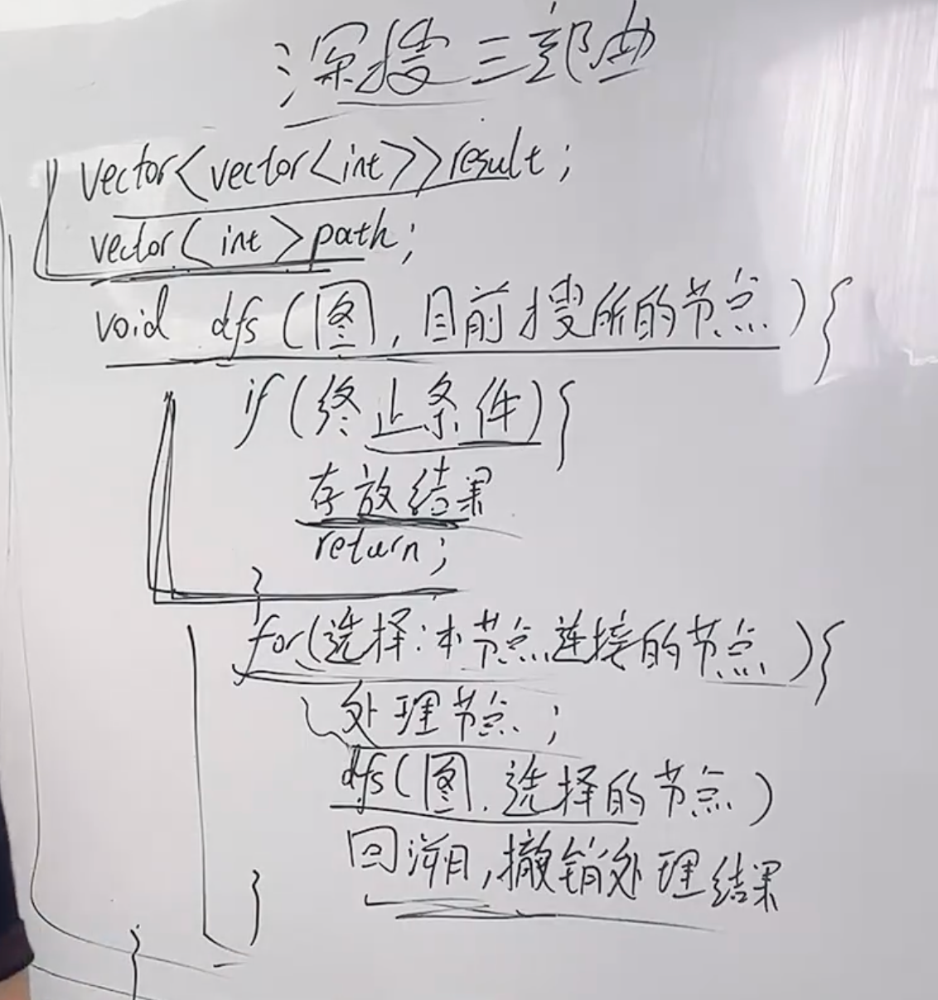

# 图的基础知识
## 种类
有向，无向

权值：边的消耗

度：有几条边连着 （无向图）

出度，入度 （有向图）

## 连通性

连通图：在**无向图**里任何一个节点可以到达其余所有节点

强连通图：在有向图里

连通分量：无向图中的极大连通子图

强连通分量：有向图中的极大连通子图

## 构造
- 朴素构造
- 邻接矩阵 （点少边多）
- 邻接表 （点多边少）

## 遍历
- 深度

- 广度
