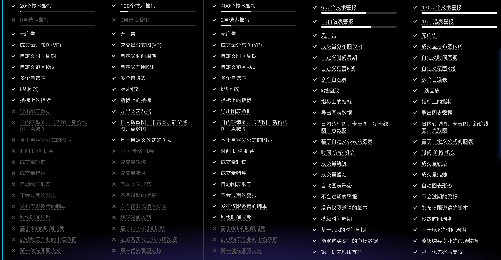
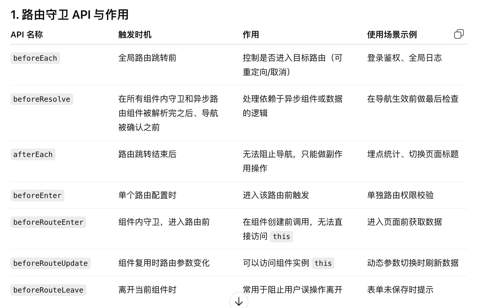
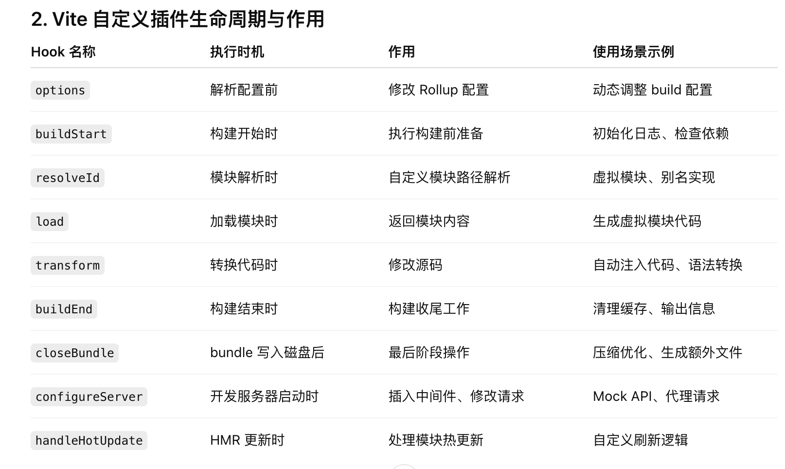
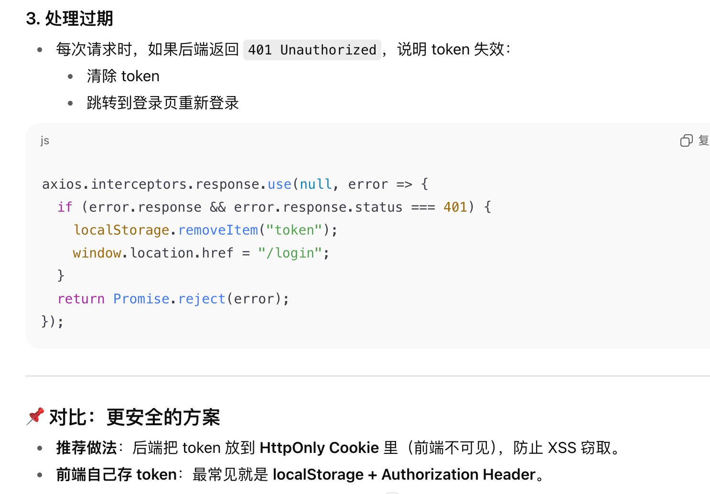

# 字节一面复盘
自我介绍
**项目**
- 难点是什么=》存储=》为什么一开始用localstorage？大概多少内存？=》是否了解过indexdb具体的？？=》是否会存在首屏白屏现象？不会，因为首次请求是直接发起的，然后把整个indexeddb读到pinia里这样查找就快了（所以这种情况应该怎么解决？查一下）=》存在覆盖现象怎么解决？
- 为什么用echarts，有没有了解过其他的画图工具-》k线蜡烛图本身自带，还有别的canvas具体要查一下
- 对于pinia，有没有做过调研，比如vuex，相比较之下的好坏
- 首屏渲染做了很多工作，有哪些方法？除了打包体积之外还有什么？=》缓存之类的有了解吗
- iframe=》有没有遇到跨域问题之类？=》微前端框架，如果用微前端来设计会怎么设计
- 工程化插件的使用
- vite和webpack的区别
- 路由守卫=》怎么做一个进入页面之前的用户不同等级的权限控制

**八股**
- vue3和vue2性能上的优化，vue3还存在哪些缺点，比如响应式为什么会失效之类的问题
- 闭包=》会导致什么问题？=》内存泄露=》具体=》怎么解决？，原型链，原型链的尽头是null吗？我的天呐好像问的是作用域链😦
- 像素单位转换，rem和em，移动端的适配之类的知识点
- 重绘和重排，怎么减少

**手撕**
promiseAll
**算法**
合并两个有序数组

# 复盘
**1. 为什么一开始用localstorage？**

因为浏览器本地存储除了localstorage，还有cookie和sessionstorage，首先数据是400只股票的股票代码字符串，而cookie只能存4kb大小，而且每次请求都会带上，没有必要每次在请求头里传股票列表

然后是sessionstorage，它的生命周期是在同一个标签页里，根本就没有办法满足这个需要跨标签页存储的需求

而localstorage是要手动操作才会清除的，5MB，肯定够存

**2. 对于indexeddb异步加载是否会存在白屏现象怎么解决？**

我的做法是在url里直接携带了当前的股票代码，这样详情页就可以立即请求返回数据，然后indexeddb在异步读取这个策略下的股票列表，再存回pinia中，这样就不会导致阻塞

这两种方法我都有了解，但没直接用。双写 + sessionStorage 的问题是刷新或直达链接时数据会丢，必须再依赖 IndexedDB 补水，等于还是要做两套逻辑；BroadcastChannel 或 Service Worker 虽然更灵活，但引入的复杂度和兼容性成本更高，而我的场景只需要“首屏可见 + 刷新可恢复”，用 URL 带 code + IndexedDB 持久化就能满足。
所以我优先选择了实现成本低、覆盖面足够的方案，而不是一上来上复杂解法。

**3. 对于打开新策略发生重复覆盖现象怎么解决？**

当时没有考虑到，如果要实现可以加一个tabid来存，用策略和选定日期做一个联合主键，有就不再存，没有就存，（一个是没有使用这个列表的标签页还开着就可以删掉，一个是定期删除）

删除怎么做呢？用 BroadcastChannel 心跳 或 Service Worker=》还没了解完

**4. 为什么选echarts**
echarts是基于canvas的，但是canvas点线之类要自己画，而且echarts对金融这方面的实现契合度很高

别的有trading view，但是付费 🤓☝️，还有Highcharts / Highstock，商业用都要米 🤕

**5. pinia和vuex的区别有调研过吗**
pinia 没有 mutations，只保留 state / getters / actions，写法直观

vuex的mutations是用来记录变量行为打印日志什么的，pinia用了vue3的devtools来调试追踪，就不需要了

**6. iframe改微前端，我的项目该怎么设计**
没必要用，硬要说怎么设计的话=》微前端框架

#### 八股复盘
**vue3和vue2性能上的优化**
- 响应式原理：Proxy 响应式替代 defineProperty
- 编译diff优化（静态标记和最长递增子序列）
- 组合式api和选择式api
- 打包体积treeshaking

**vue3有什么缺点**

**响应性失效**：

- 渲染 effect = 包裹组件渲染逻辑的副作用函数。
- 依赖收集 = 只有在渲染 effect 正在运行时访问响应式数据，才会记录“这个 effect 依赖了这个 key”。
- setup 里解构 = 在渲染 effect 之外做的取值 → 没有 activeEffect → track 不会建立依赖。

Reflect 提供了和 Proxy 拦截一一对应的原始操作方法，返回值统一为 false 或具体值

路由守卫：

vite插件生命钩子：

# **token一说**
