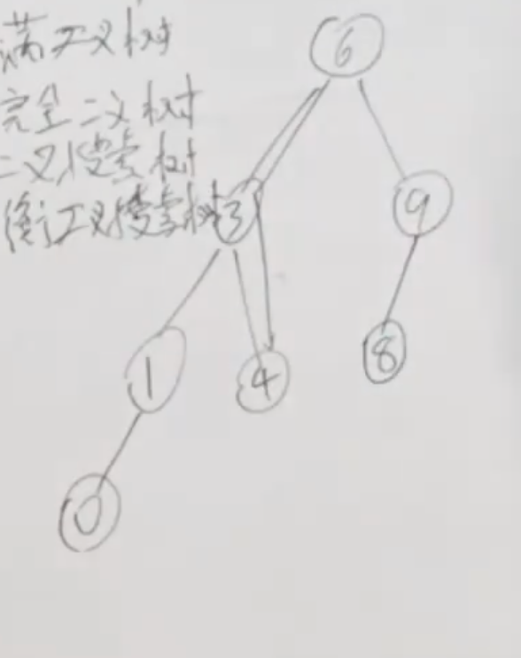

# 树的基础知识
## 分类
#### 满二叉树
满二叉树的节点个数是`2^k-1` （k是层数，从1开始计数）*利用等比数列求和公式*
#### 完全二叉树
仅允许最底层的节点不完全填满，且最底层的节点必须从左至右依次连续填充
#### 二叉搜索树
左边都小于中间，右边都大于中间
#### 平衡二叉树

是☑️

左右子树高度相差不大于1

## 存储方式
#### 链式存储
指针
#### 线式存储
数组

下标`i`的左孩子下标是`2*i+1`，右孩子下标是`2*i-1`

## 遍历
#### 深度优先搜索
前，中，后

可以用**递归**或者**迭代**来解决
#### 广度优先搜索
层序

用队列来解决

## 定义
```js
class TreeNode {
    constructor(val) {
        this.val = val;     // 节点值
        this.left = null;   // 左子节点
        this.right = null;  // 右子节点
    }
}
```
