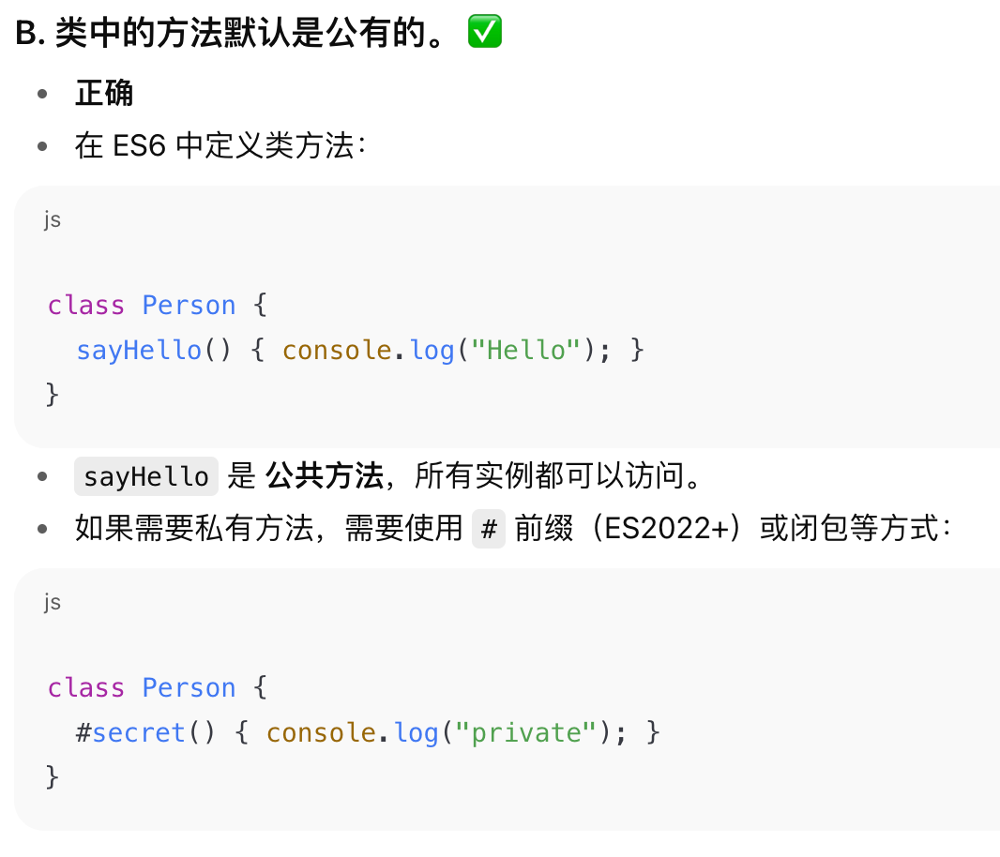

# 百度笔试

2. 


折半查找，向上取整

背包问题⚠️


预检请求（*Preflight Request*） 是 *CORS*（跨域资源共享）机制的一部分。当前端发送跨域请求时，如果是非简单请求（比如使用 `PUT、DELETE、PATCH` 方法，或自定义请求头），浏览器会先自动发送一个 `OPTIONS` 请求到服务器。**这个 OPTIONS 请求就是“预检请求”**，用来询问服务器：
- 是否允许这个跨域请求的来源（`Origin`）
- 是否支持即将使用的 `HTTP` 方法
- 是否允许使用特定的自定义请求头

如果服务器返回的 `Access-Control-Allow-*` 头信息符合条件，浏览器才会继续发送真正的跨域请求。


`text-indent`设置首行缩进

```js
font: italic 20px/1.5 arial;
```
font是一个组合属性，在本题中，`italic` 是 `font-style`，`20px`是 `font-size`，`1.5` 是 `line-height`，`arial` 是 `font-family`


flex 是 CSS Flexbox 里的一个 简写属性，对应三个子属性：
- flex-grow（放大比例）
- flex-shrink（缩小比例）
- flex-basis（初始主轴尺寸）


类：




