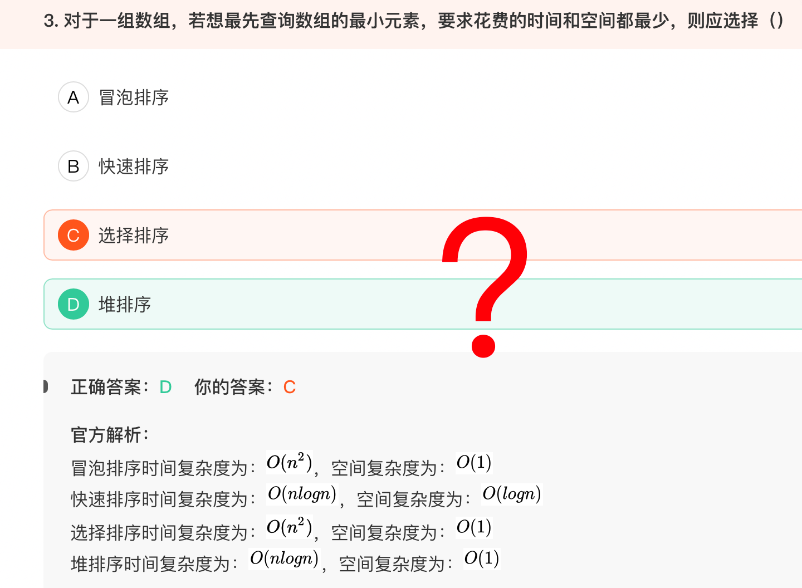

# 百度笔试卷二





由于css是从上往下执行，并且当宽度大于500px时，也一定会大于300px，从而导致第一个媒体查询失去效果，当用户将浏览器可视窗口的宽度由600px拖动到300px时，body区域一直为蓝色

CSS选择器的渲染性能排序为：id选择器>类选择器>标签选择器>通配符选择器>属性选择器


当`background-size`只有一个值为100%时，另一个取默认值auto，效果为图片的宽度为div容器的宽度，并且保持图片的原始比例不变，也就是，图片的宽度变为300px，高度也为300px，实际div高度只有200px，所以会铺满整个div容器，且多余会被截取掉，A选项不符合题意；

`Flex` 项目在主轴上的对齐方式可以通过 `justify-content` 属性设置


```js
class father {
    constructor() {
        this.name = 'Jhon';
    }
    getNum() {
        console.log(117);
    }
    name() {
        console.log('Emir');
    }
};
const son = new father();
son.getNum();
father.prototype.getNum = function() {
    console.log(935);
}
son.getNum();
son.name();

```
name属性屏蔽覆盖了name方法，因此将name属性当成函数调用会报错。


