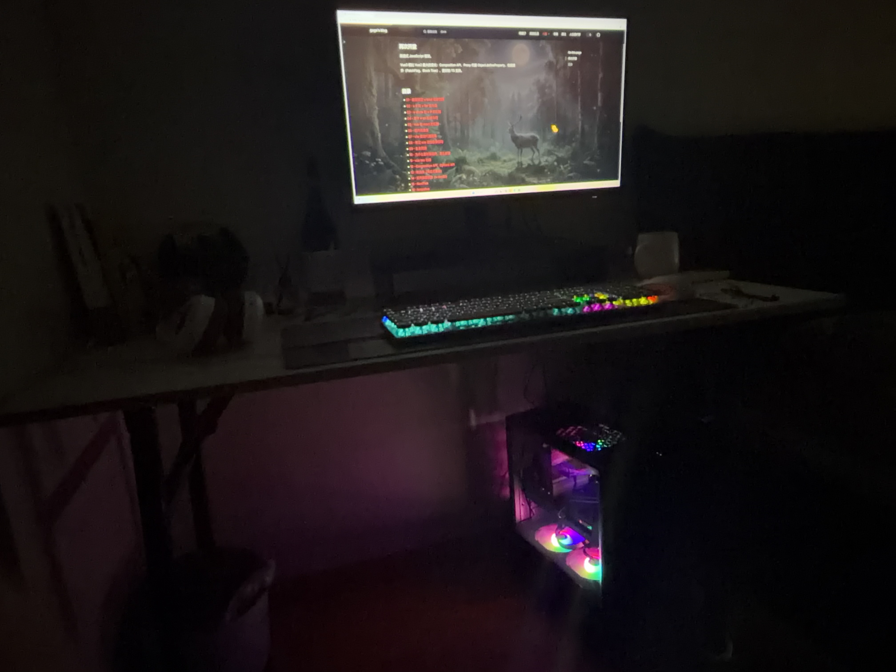
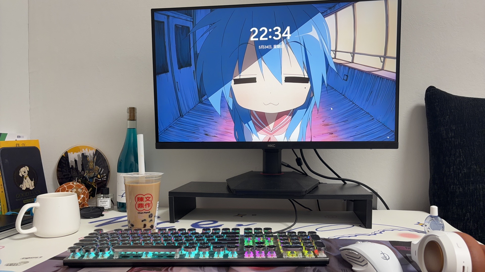

# 装机

## 最终配件

- 显卡 华硕巨齿鲨5060 8G
- 内存 runnerddr5 6000mhz cl38 16G 马甲
- cpu amd r5 7500F散片
- 主板 华硕B650M–AYW wifi
- 电源 长城g6 650w 金牌全模 95新
- 散热器 利民ax120r se青春版
- 机箱 爱国者A15 atx 亚克力侧透黑 3风扇
- 固态硬盘 三星980pro 2t
- 显示器 hkc 27寸4k 160hz
- 耳机 ikf蓝牙 / 漫步者有线
- 鼠标 罗技g102白 有线
- 键盘 惠普朋克青轴 有线

固态用的是之前轻薄本里加装的，装进主机的时候才发现散热条好像是笔记本里自带的，但是踩烂了，已丢🙂‍↔️。
显示器是司机的暂存的，先享用几个月使用权。
青轴键盘和耳机ikf是大二买的，漫步者司机随身带。
鼠标静等柯老板掏腰包。
林林总总这次共捐赠金币5706枚👋

## 步骤总括

主板装cpu=》装固态=〉装内存=》装散热器
机箱卸亚克力板卸背板卸侧板=》装主板挡片=》主板装进机箱=》装机箱风扇=》拆显卡挡板=》装显卡=》卸硬盘笼=》装电源=》接线=》整理线、安回所有板子
接显示器=》开机=》u盘刷成启动盘=》给主机装系统win11=》激活（淘宝三块钱买一个）=》更新驱动（我更了显卡、蓝牙）=》王朝

## 坑坑洼洼

关于拆固态这件事，由于轻薄本太fvv了（开机要五分钟），在没有开机做任何处理的情况下直接卸下。螺丝刀是内六角螺旋，美团十块钱买了一整套，之前装固态的时候没有这种螺丝刀根本拧不下来还把螺丝拧花了😇。

因为机箱是周六到的，其他配件周五晚上全部到家了，实在没忍住还想装个裸机来着，装到最后发现要机箱的电源开机重置键，虽然看教程可以短接测试，但是太晚了好困晚安世界～

第二天发现显卡装的步骤错了，先把主板塞进机箱再装显卡。好吧，其实电源线我也插完了，没关系。我拆。

机箱螺丝贼多，主板记得要用垫片把机箱原来没垫但是主板需要拧螺丝的地方垫高，不然拧一半的时候就懵逼了（指我自己😳）

关于螺丝刀，🤓，美团十块钱的小螺丝刀手柄太滑了，拧不开cpu原来的主板板托，晚上和司机出去drunk顺手带了个回来。这把螺丝刀可以上大分，机箱之后所有的螺丝都是十字✌️

go on，显卡的卡槽。掰开后按进显卡会自动弹回，不需要手动再处理。（没错，我又手动掰开了一次🙂‍↔️）

底部两个风扇会上下动，因为长螺丝没有完全拧进去，机箱的螺纹太浅了。但是因为在底部，目前使用来看好像没有什么影响。

启动盘用的是刚买的闪迪😭，我舍不得但是找了半天新家里只有这一个u盘。然后最后还是要打开二战时期的轻薄本，感觉它没了加装的固态之后开机和交互更慢了。。。想起来之前装软路由，因为没有显示器，又找了一个all in one的教程🤓，最后的结果是拿轻薄本当系统启动盘，给win系统刷没了（全员起立鼓掌👏）

然后主板买的是带wifi的，但是装系统的时候记得断网（到网络配置的时候就可以跳过了），视频教程会附在文章后面。

分区就不分了，2t的c盘，我支持下面这句话：

以及启动盘恢复成普通u盘，格式化选择EXFAT，这样win和mac才都能用。

因为用的是老硬盘，所以分区直接全删了。我想不起来里面有啥了，之后可能再装个虚拟机，如果有用的话，感觉用处不大，因为有阿里云服务器了。

进bios的时候把内存条expo开起来，这样就会到6000mhz，没开只有3700mhz

## 展示战绩

好帅wok

锁屏～

## 视频教程

- 【【装机教程】官方正版win10/11安装指南，2026保姆级安装教程，常见问题解决！小白也可轻松掌握！-哔哩哔哩】 https://b23.tv/6xcJFQF
- 【4分钟帮你搞定把系统U盘恢复为普通U盘-哔哩哔哩】 https://b23.tv/c92ZSjp
