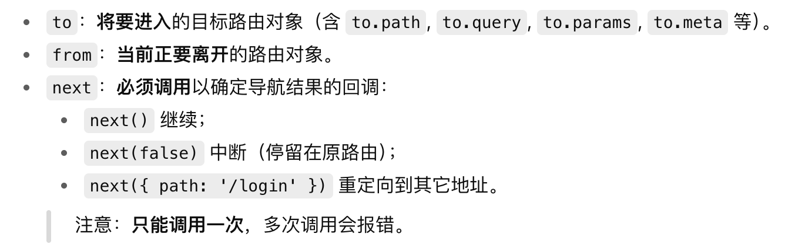

# 封装图表
父子通信相关知识，stores，pinia存储相关知识

量化平台这个项目，主要负责的是前端部分的开发，
将爬虫得到的股票行情数据进行算法分析量化，然后在前端用echarts图表展示
### 封装图表组件
封装组件这一块，对缩略图和详情页的图表组件进行了封装，

因为不同的图表展示的series里的配置是不一样的，但是重复的占比很高，所以我就把它封装成了一个组件。在组件里写一张预设表，通过父子通信props接受父组件传进来的type，来选择哪些部分要渲染，哪些部分不要。

大概是三百多行
### 图表分页功能
图表分页因为数据量很大所以采用的是后端分页的方法，就是点击翻页的时候我把页码传给后端，然后收到数据重新渲染页面

### 全屏放大功能
全屏放大用了vue的动态绑定属性，浏览器的dom api，一个是点按钮；一个是监听整个浏览器的全屏状态，当用户退出全屏状态，比如按了esc，浏览器会自动退出全屏模式，但是为了保证UI同步，要监听这个状态，及时进行UI的更新
- document.fullscreenElement 判断当前是否在全屏，有就返回当前全屏的dom元素，没有返回null
- wrapper.requestFullscreen 让指定节点进入全屏
- document.exitFullscreen 退出当前全屏状态

```js
onMounted(() => {
  document.addEventListener('fullscreenchange', handleFullscreenChange)
})
onBeforeUnmount(() => {
  document.removeEventListener('fullscreenchange', handleFullscreenChange)
})
在 挂载 时注册监听 → 确保 DOM 已经在了，事件能用。
在 卸载 时注销监听 → 避免内存泄漏和报错。
这是 Vue 组件里操作全局事件的 标准做法。
```
```js
为什么要调用 chart.resize()？
期望回答：ECharts 图表不会自动检测容器大小变化，全屏后容器尺寸变了，必须手动 resize()，否则会显示不完整。
为什么 resize() 要用 setTimeout 延迟？
期望回答：进入/退出全屏时 DOM 的布局需要时间，立即调用可能获取到旧的宽高，加个小延迟能保证图表自适应正常。
```

### 图片导出功能
```js
function exportChart(idx, name) {
  const chart = charts.value[`chart${idx}`]
  const img = chart.getDataURL({ pixelRatio: 2, backgroundColor: '#fff' })
  const a = document.createElement('a')
  a.href = img
  a.download = `${name}.png`
  a.click()
}
chart.getDataURL(options) 是 ECharts 提供的导出方法，返回一个 Base64 编码的 PNG 图片字符串。
document.createElement('a') 新建一个隐藏的 <a> 标签。
设置 a.href = img，把图表的 base64 图片放到链接里。
设置 a.download = '文件名.png'，指定下载后的文件名。
a.click() → 相当于用户手动点击了下载按钮，浏览器就会弹出“保存图片”的对话框。
```

### 路由懒加载
这里的 component: () => import('...') 就是 路由懒加载。

Vue Router 遇到这种写法不会一次性把所有页面打包进 bundle.js；

而是在用户真正访问这个路由的时候，才去加载对应的 .vue 文件；

这样可以减少首屏加载体积，提升性能

### 路由守卫

```js
router.beforeEach(async (to, from, next) => {
  // 需要登录的页面
  const needLogin = ['/trading', '/StockFmark'];
  // 读取本地 user 信息
  const userStr = localStorage.getItem('stock_app_user');
  let token = '';
  if (userStr) {
    try {
      token = JSON.parse(userStr).token;
    } catch {
      token = '';
    }
  }
  if (needLogin.includes(to.path) && !token) {
    next({ path: '/' });
  } else {
    next();
  }
});
```

### 


