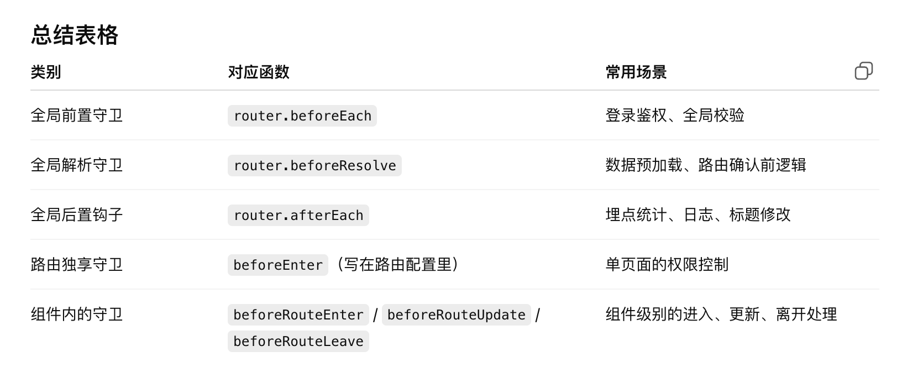

# 封装图表
父子通信相关知识，stores，pinia存储相关知识

量化平台这个项目，主要负责的是前端部分的开发，
将爬虫得到的股票行情数据进行算法分析量化，然后在前端用echarts图表展示
### 封装图表组件
封装组件这一块，对缩略图和详情页的图表组件进行了封装，

因为不同的图表展示的series里的配置是不一样的，但是重复的占比很高，所以我就把它封装成了一个组件。在组件里写一张预设表，通过父子通信props接受父组件传进来的type，来选择哪些部分要渲染，哪些部分不要。

大概是三百多行
### 图表分页功能
图表分页因为数据量很大所以采用的是后端分页的方法，就是点击翻页的时候我把页码传给后端，然后收到数据重新渲染页面

### 全屏放大功能
全屏放大用了vue的动态绑定属性，浏览器的dom api，一个是点按钮；一个是监听整个浏览器的全屏状态，当用户退出全屏状态，比如按了esc，浏览器会自动退出全屏模式，但是为了保证UI同步，要监听这个状态，及时进行UI的更新
- document.fullscreenElement 判断当前是否在全屏，有就返回当前全屏的dom元素，没有返回null
- wrapper.requestFullscreen 让指定节点进入全屏
- document.exitFullscreen 退出当前全屏状态

```js
onMounted(() => {
  document.addEventListener('fullscreenchange', handleFullscreenChange)
})
onBeforeUnmount(() => {
  document.removeEventListener('fullscreenchange', handleFullscreenChange)
})
在 挂载 时注册监听 → 确保 DOM 已经在了，事件能用。
在 卸载 时注销监听 → 避免内存泄漏和报错。
这是 Vue 组件里操作全局事件的 标准做法。
```
```js
为什么要调用 chart.resize()？
期望回答：ECharts 图表不会自动检测容器大小变化，全屏后容器尺寸变了，必须手动 resize()，否则会显示不完整。
为什么 resize() 要用 setTimeout 延迟？
期望回答：进入/退出全屏时 DOM 的布局需要时间，立即调用可能获取到旧的宽高，加个小延迟能保证图表自适应正常。
```

### 图片导出功能
```js
function exportChart(idx, name) {
  const chart = charts.value[`chart${idx}`]
  const img = chart.getDataURL({ pixelRatio: 2, backgroundColor: '#fff' })
  const a = document.createElement('a')
  a.href = img
  a.download = `${name}.png`
  a.click()
}
chart.getDataURL(options) 是 ECharts 提供的导出方法，返回一个 Base64 编码的 PNG 图片字符串。
document.createElement('a') 新建一个隐藏的 <a> 标签。
设置 a.href = img，把图表的 base64 图片放到链接里。
设置 a.download = '文件名.png'，指定下载后的文件名。
a.click() → 相当于用户手动点击了下载按钮，浏览器就会弹出“保存图片”的对话框。
```

### 路由懒加载
这里的 component: () => import('...') 就是 路由懒加载。

Vue Router 遇到这种写法不会一次性把所有页面打包进 bundle.js；

而是在用户真正访问这个路由的时候，才去加载对应的 .vue 文件；

这样可以减少首屏加载体积，提升性能

### 路由守卫

```js
router.beforeEach(async (to, from, next) => {
  // 需要登录的页面
  const needLogin = ['/trading', '/StockFmark'];
  // 读取本地 user 信息
  const userStr = localStorage.getItem('stock_app_user');
  let token = '';
  if (userStr) {
    try {
      token = JSON.parse(userStr).token;
    } catch {
      token = '';
    }
  }
  if (needLogin.includes(to.path) && !token) {
    next({ path: '/' });
  } else {
    next();
  }
});
```

vue的五种路由守卫：


# 存储优化
关于存储优化这一块当时的背景大概是这样，用户勾选了某个股票策略之后，当前页面显示的是九只符合这个策略的股票的缩略图，点击其中一张图的股票名称就会进行跳转到展示该只股票的详情数据页，这个是新开一个标签页。然后有一个需求就是要在这个新开的标签页进行上下页翻页，那如果要知道当前策略下的所有股票编号，就有两种方法。
第一种就是在当前这个页面向后端发起请求，把我这里存的当前日期、当前策略、当前查询的股票编号定位发给后端，然后后端重新做一遍查询，把这个股票列表返回给我，我存储下来之后根据数组的下标进行跟翻页页码的对应查找。

但是这种方法的问题就是在后端要重新做一遍查询，而数据库存了大概是五百万条股票数据，所以就很麻烦，然后我们沟通了一下最后是决定在上一个标签页查询缩略图的同时，就把这个查找到的股票代码返回给我。

然后这样就出现一个问题是，因为vue是单页面框架，我新开一个标签页之后，组件之间或者是pinia全局就无法跨标签页存储，所以我用到了localstorage浏览器本地存储方式，这样虽然是可以实现这个需求了，但是我发现会导致页面渲染速度非常慢。一开始我是怀疑后端数据库查询速度慢的问题，但是发现直接url请求，后端返给我的json并没有这么慢。

为了解决这个问题，我也查过echarts图表性能优化资料，比如开启大数据模式，折线抽稀等等，但是我们做的数据展示其实还没有到那么大，所以图表优化上效果并没有很明显。

最后是把localstorage改成了indexedDB这个浏览器的数据库来存，因为localstorage是同步的，所有读写都会在主线程，会阻塞当前标签页的 JS 与渲染线程，而且还有字符串的序列化反序列化之类的操作，以及IO操作，同源页面之间存在全局锁，都会导致首屏渲染速度，而indexeddb就是异步非阻塞的。然后也很明显的可以看到首屏渲染从8s降到了2s左右，跟请求拿到json数据的时间是差不多的，剩下的是后端可以继续优化查询以及数据库的索引优化等等。


补充也进行了对比，比如pinia-plugin-persistedstate 的设计目标就是 简单地把 Pinia 状态序列化到 localStorage / sessionStorage / cookies，所以它内置只支持这几种存储。官方文档里没有对 IndexedDB 的适配。

### pinia
统一管理全局变量，跨组件通信更方便
比如把chart存进pinia，在导出，全屏的时候就更方便，可以直接拿charts.value[id]，拿到实例

pinia解构不失去响应性的话要用storeToRefs

defineStore分为state和action

### 关于token
在请求头中加入
```js
headers: {
  'Authorization': `Bearer ${this.usetoken}`
}
```

# iframe
为了方便客户使用，需要查询股票在东方财富网站上的其他信息，但是东财没有提供这个接口，所以没办法像图表那样发ajax请求来获取数据，就用了iframe，iframe的话它有独立的文档环境，局部刷新，不会影响父页面

# 跨域
有几种跨域解决方案，第一个是jsonp，利用script标签src不受同源限制，但是只能get，然后后端要配合；

第二个是后端在响应头里配置白名单：Access-Control-Allow-Origin: '域名白名单'

第三个是配置nginx反向代理

websocket

postMessage

# vue的两种路由
hash路由和history路由


