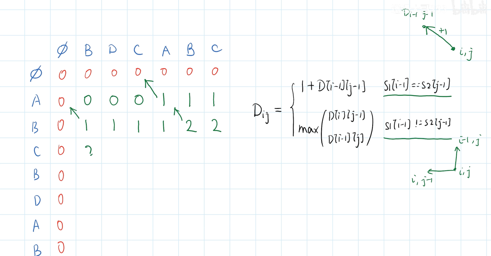

# 20250512

- 76/100速速写完
- 看一下查询的逻辑
- 递归查询到最新有数据的日期

() => new Array(4).fill(0);

没有{}会隐式返回，有{}一定要写return

最长公共子序列：

【[轻松掌握动态规划]5.最长公共子序列 LCS】 https://www.bilibili.com/video/BV1ey4y1d7oD/?share_source=copy_web&vd_source=c7a8c2728d5ed02cdd74fed0dbaa1168

编辑距离：

【[轻松掌握动态规划]6.编辑距离】 https://www.bilibili.com/video/BV1sA411B73r/?share_source=copy_web&vd_source=c7a8c2728d5ed02cdd74fed0dbaa1168