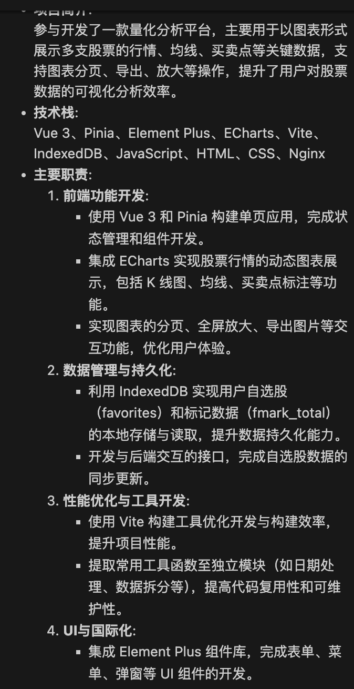

# 20250515

上午：

前进后退实现☑️

力扣写完

空值合并运算符（??）是一个逻辑运算符，当左侧的操作数为 null 或者 undefined 时，返回其右侧操作数，否则返回左侧操作数。

https://developer.mozilla.org/zh-CN/docs/Web/JavaScript/Reference/Operators/Nullish_coalescing

下午：

css和js的八股

晚上：

看stock-quant代码改：https://www.wondercv.com

