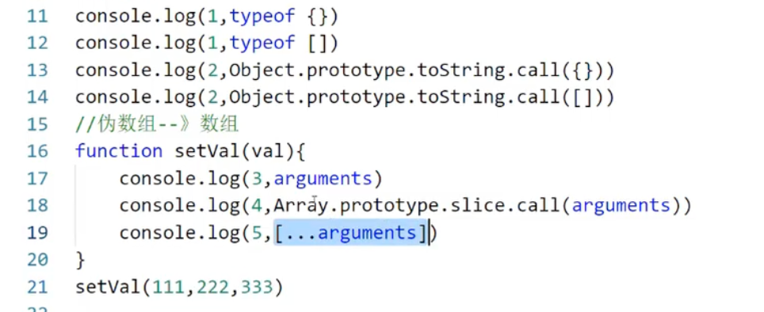

# 20250823
- 执行上下文
- 作用域和作用域链
- 闭包
- 原型和原型链
- this指向
- 高阶函数
- 设计模式（大块）
- call，apply，bind
- 箭头函数
- 深浅拷贝
- 防抖节流
- 浏览器如何渲染页面
- 同步和异步
- 事件循环

### 手写
- new
- bind
- 防抖
- 节流
- 深拷贝
- 手写垃圾回收器？

- 动画什么的优化（好像是RAF）get
- css树和dom树，阻塞什么的 get
- RIC 和 RAF get
- 