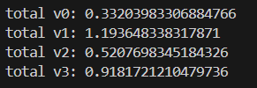
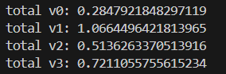
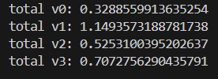
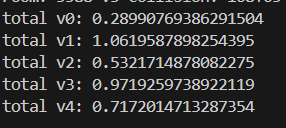

内层mesh的质心在外层物体的内部->包含

问题：


凸体 

非凸体：存在至少一对点，它们连线的一部分在物体外部。
一般是有凹陷、中空、洞、缺角 或 形状弯折。
eg. L形体，马蹄形，星形，环形/甜甜圈，含孔洞多边形，凹多面体

api
contains 检查质心是否在物体内部

request = fcl.CollisionRequest(num_max_contacts=1, enable_contact=True) # 需要的最大接触点数量，是否返回接触点信息

v2 _objects_overlap
同一对象不检测
AABB初筛
AABB有包含->进入fcl碰撞检测
无碰撞-> 包含判断
_geometric_contains
包含判断过程：
aabb初筛
水密性
质心

场景内部碰撞检测 in_collision_internal
创建rtree
遍历每个对象
找与该对象aabb相交所有对象 rtree_search_items
遍历每个相交对象

测试结果
v2 v3碰撞数量相同，包含v3增加

自定义批量碰撞检测+包含检测


直接调用trimesh原生碰撞检测+包含检测


优化循环


其他优化



最后结果



```py
from typing import List, Tuple, Dict
import trimesh
import numpy as np
from rtree import index


class ContainCollisionManagerV3:
    """
    检测mesh间碰撞与包含关系
    使用trimesh原生的CollisionManager进行碰撞检测
    """

    def __init__(self):
        self._meshes: Dict[str, trimesh.Trimesh] = {}
        self._collision_manager = trimesh.collision.CollisionManager()
        self._rtree_idx = None
        self._rtree_ids: Dict[str, int] = {}
        self._object_ids: List[str] = []
        self._bounds_cache: Dict[str, np.ndarray] = {}
        self._centroid_cache: Dict[str, np.ndarray] = {}

    def add_object(self, name: str, mesh: trimesh.Trimesh):
        """添加物体到场景中"""
        if name in self._meshes:
            raise ValueError(f"Object '{name}' already exists.")

        mesh = mesh.copy()
        mesh.remove_unreferenced_vertices()
        mesh.remove_duplicate_faces()

        self._meshes[name] = mesh
        self._bounds_cache[name] = mesh.bounds.copy()
        self._centroid_cache[name] = mesh.centroid.copy()
        self._object_ids.append(name)
        # 使用trimesh原生的CollisionManager添加对象
        self._collision_manager.add_object(name, mesh)
        self._rtree_idx = None

    def remove_object(self, name: str):
        """从场景中移除物体"""
        if name not in self._meshes:
            raise KeyError(f"Object '{name}' not found.")

        if self._rtree_idx is not None and name in self._rtree_ids:
            entry_id = self._rtree_ids[name]
            bounds = tuple(self._bounds_cache[name].flatten())
            self._rtree_idx.delete(entry_id, bounds)
            del self._rtree_ids[name]

        # 从trimesh CollisionManager中移除
        self._collision_manager.remove_object(name)
        del self._meshes[name]
        del self._bounds_cache[name]
        del self._centroid_cache[name]
        if name in self._object_ids:
            self._object_ids.remove(name)

    def _ensure_rtree(self):
        if self._rtree_idx is not None:
            return
        p = index.Property()
        p.dimension = 3
        self._rtree_idx = index.Index(properties=p)
        self._rtree_ids.clear()
        for i, name in enumerate(self._object_ids):
            bounds = tuple(self._bounds_cache[name].flatten())
            self._rtree_idx.insert(i, bounds, obj=name)
            self._rtree_ids[name] = i

    @staticmethod
    def _aabb_overlap(aabb1: np.ndarray, aabb2: np.ndarray) -> bool:
        return not (np.any(aabb1[1] < aabb2[0]) or np.any(aabb2[1] < aabb1[0]))

    @staticmethod
    def _aabb_contains(aabb_outer: np.ndarray, aabb_inner: np.ndarray) -> bool:
        return bool(
            np.all(aabb_outer[0] <= aabb_inner[0])
            and np.all(aabb_inner[1] <= aabb_outer[1])
        )

    def _geometric_contains(
        self, outer_name: str, inner_names: List[str]
    ) -> List[bool]:
        if len(inner_names) == 1:
            inner_name = inner_names[0]
            if self._aabb_contains(
                self._bounds_cache[outer_name], self._bounds_cache[inner_name]
            ):
                if self._meshes[outer_name].is_watertight:
                    return [
                        self._meshes[outer_name].contains(
                            [self._centroid_cache[inner_name]]
                        )[0]
                    ]
                else:
                    return [True]
            return [False]
        contains_results = [
            self._aabb_contains(
                self._bounds_cache[outer_name], self._bounds_cache[inner_name]
            )
            for inner_name in inner_names
        ]

        if not any(contains_results) or not self._meshes[outer_name].is_watertight:
            return contains_results

        mesh_o = self._meshes[outer_name]
        mesh_contains_idxes = []
        center_list = []
        for idx, inner_name in enumerate(inner_names):
            if contains_results[idx]:
                mesh_contains_idxes.append(idx)
                center_list.append(self._centroid_cache[inner_name])
        center_list = np.array(center_list)
        mesh_contain_results = mesh_o.contains(center_list)
        for idx, origin_idx in enumerate(mesh_contains_idxes):
            contains_results[origin_idx] = mesh_contain_results[idx]
        return contains_results

    def in_collision_internal(self, return_names=False):
        """检测场景中是否存在碰撞"""
        self._ensure_rtree()
        colliding_pairs = set()
        collided_pairs = set()
        contain_pairs = set()
        processed = set()

        # 使用trimesh原生的CollisionManager进行碰撞检测
        _, collision_names = self._collision_manager.in_collision_internal(return_names=True)
        for name_pair in collision_names:
            # trimesh返回的是排序后的元组
            if isinstance(name_pair, tuple) and len(name_pair) == 2:
                name1, name2 = name_pair
                collided_pairs.add((name1, name2))
            else:
                # 兼容其他格式
                collided_pairs.add(name_pair)
        
        processed |= collided_pairs

        # 检测包含关系
        for name in self._object_ids:
            bounds = tuple(self._bounds_cache[name].flatten())
            rtree_search_items = self._rtree_idx.intersection(bounds, objects=True)
            left_item_pairs = set(
                [
                    (name, item.object)
                    for item in rtree_search_items
                    if (name, item.object) not in processed
                    and (item.object, name) not in processed
                ]
            )
            processed |= left_item_pairs
            if len(left_item_pairs) == 0:
                continue

            left_item_names = [i[1] for i in list(left_item_pairs)]
            contain_results = self._geometric_contains(name, left_item_names)
            pair_set = set(
                [
                    (name, left_item_names[i])
                    for i in range(len(contain_results))
                    if contain_results[i]
                ]
            )
            contain_pairs |= pair_set

        colliding_pairs |= collided_pairs
        colliding_pairs |= contain_pairs

        if return_names:
            return list(colliding_pairs), list(collided_pairs), list(contain_pairs)
        else:
            return len(colliding_pairs) > 0

```